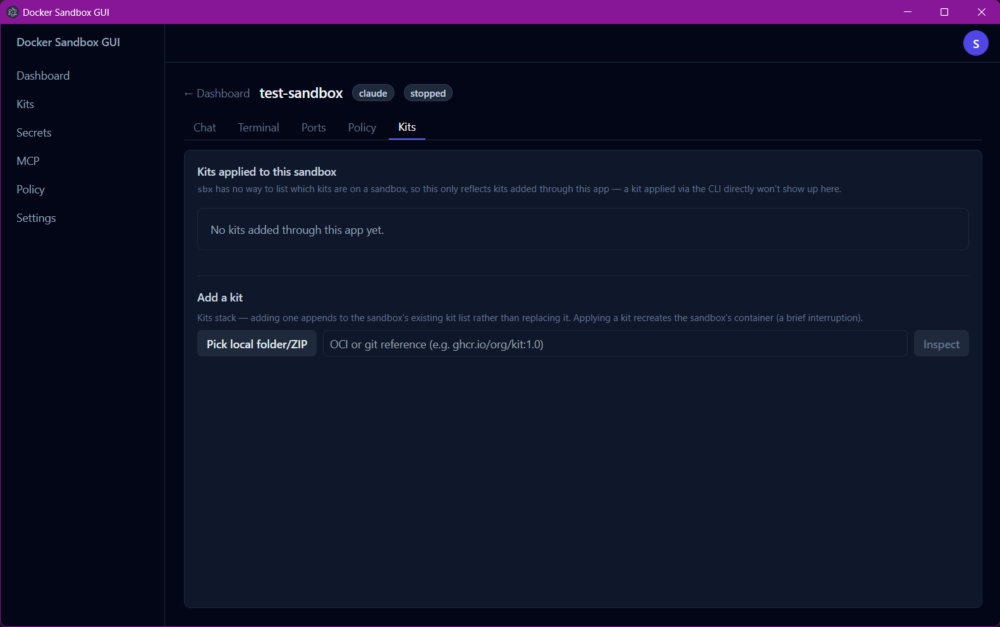
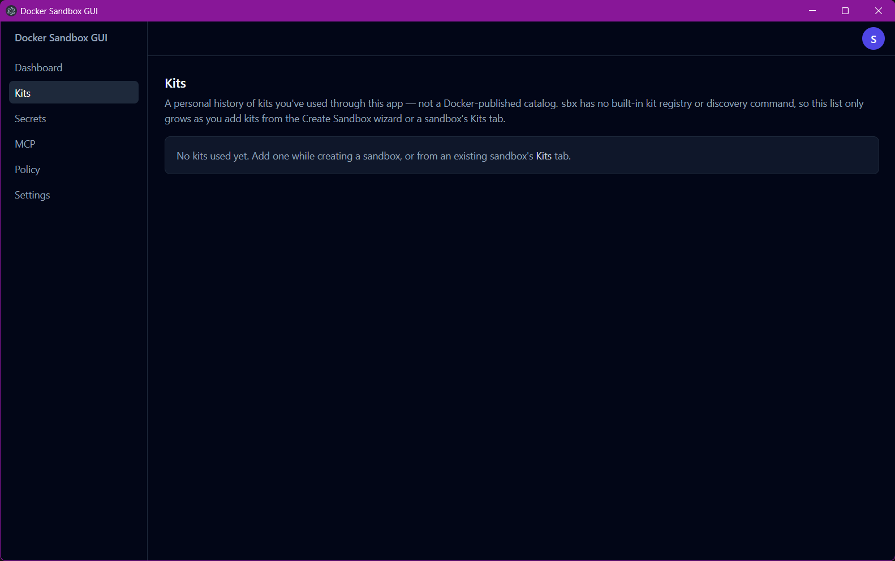

# Docker Sandbox GUI

A desktop GUI for [Docker Sandboxes](https://docs.docker.com/ai/sandboxes/) — create, manage, and chat with AI coding agent sandboxes without ever touching a terminal.

Docker Sandboxes (the `sbx` CLI) runs AI coding agents like Claude Code in isolated microVMs, each with its own Docker daemon, filesystem, and network policy. This app wraps that CLI in a native Windows desktop app so the whole workflow — creating sandboxes, applying kits, publishing ports, managing MCP connectors, setting network policy, and having the actual agent conversation — happens in a GUI window instead of a shell.

Status: early, actively developed. Windows-first; a macOS build is scaffolded but unsigned/untested — no Mac available to build on locally, though the GitHub Actions release workflow can now build one on a real `macos-latest` runner (see below), not yet exercised for a real release.

## Table of contents

- [How to use it](#how-to-use-it)
  - [Prerequisites](#prerequisites)
  - [Running from source](#running-from-source)
  - [Building an installer](#building-an-installer)
  - [Using the app](#using-the-app)
  - [Running on macOS](#running-on-macos)
  - [Running on Linux](#running-on-linux)
- [How it's built](#how-its-built)
- [Security measures](#security-measures)
- [Planned / upcoming work](#planned--upcoming-work)

## How to use it

### Prerequisites

- Windows 11 (x64), with Hypervisor Platform enabled
- [Docker Sandboxes (`sbx`)](https://docs.docker.com/ai/sandboxes/get-started/) installed — `winget install -h Docker.sbx` — and signed in (`sbx login`)
- Node.js 22+ (only needed to build/run from source — not required once you have a packaged installer)

### Running from source

```bash
npm install      # also builds node-pty's native module — see note below
npm run dev       # launches the app with hot reload
```

> **First install only:** `node-pty` compiles a native module and needs the Visual Studio Build Tools ("Desktop development with C++" workload, including the Spectre-mitigated libraries individual component) plus Python. If `npm install` fails on `node-pty`, that's almost always the missing piece — install the Build Tools and re-run `npm install`.

> **If `npm run dev`/`electron-vite dev` fails with no Electron binary found (or `node_modules/electron/dist/` is simply missing after a clean install):** confirmed live on macOS behind a network proxy/allowlisting tool (in this case Socket Firewall) — `npm install`'s `postinstall` step runs `node node_modules/electron/install.js`, which fetches Electron's actual `.app`/Chromium runtime via a direct HTTPS request to Electron's own CDN, **not** the npm registry. A proxy that only recognizes and reports on registry traffic can silently drop that request instead of failing loudly, so `npm install` exits with no errors ("added N packages", 0 vulnerabilities) while the binary was simply never downloaded. If `node_modules/electron/dist/Electron.app` (or the platform equivalent) doesn't exist and `npx electron --version` fails, run `node node_modules/electron/install.js` by hand — it's silent on success — then retry. `node-pty`'s own native module didn't hit this, since it ships a prebuilt binary per-platform inside its own npm package rather than fetching one separately.

### Building an installer

**Windows:**

```bash
npm run build:win
```

Produces `release/Docker Sandbox GUI-<version>-win-setup.exe` (and a `.msi`). It's currently unsigned, so Windows SmartScreen will flag it on first run — **More info → Run anyway**.

The app icon (`build/icon.ico`/`.icns`, auto-generated by electron-builder from `build/icon.png`) is Docker's own whale mark — the black variant, deliberately, so it reads as visually distinct from Docker Desktop's blue one in the taskbar. Using Docker's trademarked logo is fine here specifically because this repo is private with Docker-employee-only collaborators; it would not be an appropriate choice for a public, unaffiliated third-party tool.

**macOS** (must be run *on* a Mac — see [Running on macOS](#running-on-macos) below for why):

```bash
npm install       # needs Xcode Command Line Tools for node-pty — xcode-select --install
npm run build:mac
```

Produces `release/Docker Sandbox GUI-<version>-mac-arm64.dmg` (Apple Silicon only, matching `sbx`'s own requirement). It's unsigned and unnotarized, so Gatekeeper will block it on first launch — right-click the app → **Open** usually works, but on newer macOS (Ventura/Sonoma) a fully unsigned app can instead get a flat **"is damaged and can't be opened"** message with no "Open anyway" option at all — that's Gatekeeper's quarantine check refusing outright, not an actually corrupted download. Fix, confirmed live:

1. Drag **Docker Sandbox GUI.app** into `/Applications` (the check runs against the installed copy, not the mounted `.dmg`).
2. From Terminal: `xattr -cr "/Applications/Docker Sandbox GUI.app"` — strips every extended attribute recursively, including the `com.apple.quarantine` flag Gatekeeper checks before it ever evaluates (and, for a fully unsigned app, flatly refuses) the app. Resolves both the "damaged" message and the plain "unidentified developer" prompt.
3. Launch normally.

**If it still says "damaged" after that exact command**, that's no longer a Gatekeeper quarantine issue — `xattr -cr` only clears extended attributes, so it can't fix an app bundle that's genuinely incomplete or corrupted. Most likely cause: a truncated or interrupted download. Re-download the `.dmg` from the [Release](https://github.com/SethBonser/Docker-SBX-GUI/releases) page and compare its file size against the other platform installers in the same release (they should all be in the same rough ballpark) before retrying steps 1–3. `spctl -a -vv "/Applications/Docker Sandbox GUI.app"` (also from Terminal) will print Gatekeeper's actual verdict and reason if you want to confirm which case you're in before re-downloading.

**Linux** (must be run *on* Linux — see [Running on Linux](#running-on-linux) below):

```bash
npm install       # needs build-essential + python3 for node-pty
npm run build:linux
```

Produces `release/Docker Sandbox GUI-<version>-linux.AppImage` (x64). Unsigned, and — unlike Windows/macOS — has never actually been run on a real Linux machine by anyone yet; see the warning below before relying on it.

**Or via GitHub Actions** (`.github/workflows/release.yml`), instead of building all three platforms by hand: open the **Actions** tab → **Release** → **Run workflow**, type a version (e.g. `0.10.0`, no `v` prefix), and leave **Mark as a pre-release** checked until the app has had real-world testing beyond this repo. Deliberately **manually triggered** (`workflow_dispatch`), not on a tag push — the version is something to choose deliberately each time, not derive from commit history. It builds Windows (`nsis` + `msi`) on `windows-latest`, macOS (`.dmg`) on `macos-latest`, and Linux (`AppImage`) on `ubuntu-latest` — real hosts for each OS, unlike this project's own Windows dev machine, which can only actually build and test the Windows leg itself. macOS and Linux are both allowed to fail without blocking the release (`continue-on-error`): since both are genuinely untested, a first-run hiccup on either shouldn't hold back a Windows release; the release still goes out with whatever subset of installers actually built, and the workflow's own guard refuses to publish an *empty* release if somehow nothing built at all. Doesn't touch code signing — output is exactly as unsigned/unnotarized as a local build (see above); that's still a separate decision needing a Windows code-signing cert and an Apple Developer identity (Linux AppImages aren't typically signed at all).

<details>
<summary>Real bugs found the first few times the release workflow actually ran (click to expand)</summary>

None of these ever surfaced in local testing, because local testing had only ever used `electron-builder --win dir` (the unpacked-directory target, which skips installer generation entirely) rather than the real `build:win`/`build:mac`/`build:linux` scripts:

- **The MSI target hard-fails without a custom app icon** — confirmed live: `error LGHT0094: The identifier 'Icon:...' could not be found`, a WiX linker error. NSIS and DMG both tolerate a missing icon (falling back to Electron's default with just a log line); MSI's WiX-based packaging does not. Fixed by adding `build/icon.png` (see above) — once present, electron-builder auto-generates the `.ico`/`.icns` for every target from that one source, no per-platform icon files needed.
- **electron-builder auto-detects CI and tries to implicitly publish itself**, failing with `GitHub Personal Access Token is not set` — it has its own built-in GitHub-publish integration that isn't what this project uses (publishing is handled by the `release` job's own `gh release create` step instead). Fixed with `--publish never` on the `build:win`/`build:mac`/`build:linux` npm scripts. Confirmed live that `publish: never` as a YAML key in `electron-builder.yml` does *not* work despite looking like the obvious fix — the YAML `publish` field expects a provider config object, and treated the literal string `"never"` as a plugin name to load, failing with `Cannot find module for publisher "never"`. `never` is only a valid value for the `--publish` *CLI flag*, not the YAML key.
- **The `release` job's own artifact-gathering broke on filenames with spaces** — confirmed live: `productName: Docker Sandbox GUI` means every installer filename has spaces in it (`Docker Sandbox GUI-0.10.0-arm64.dmg`), and the original script collected `find`'s output into a plain string, then passed it to `gh release create` unquoted — word-splitting broke each filename into fragments, which `gh` then tried to glob-match and failed on (`no matches found for `artifacts/macos-installer/Docker``). Fixed by switching to NUL-delimited `find -print0` piped into a bash array (`mapfile -d ''`) instead of a plain `$()` string, which is the standard-correct way to handle filenames with spaces in bash and was verified locally against files actually named with spaces before trusting it in CI again.
- **Installer filenames didn't say which platform they were for** — with all three platforms' installers dropped into one GitHub Release, `Docker Sandbox GUI-<version>-setup.exe`/`.msi` were the only ones that read unambiguously; the `.dmg` only had `-arm64` (no `mac`/`win`/`linux` token at all) and the `.AppImage` had neither. Fixed in `electron-builder.yml` using electron-builder's `${os}` artifact-name macro (confirmed live it resolves to exactly `win`/`mac`/`linux`, matching each platform's own config section key) — installers are now `Docker Sandbox GUI-<version>-win-setup.exe`/`.msi`, `-mac-arm64.dmg`, and `-linux.AppImage`. `release.yml` itself needed no change, since its own artifact-gathering globs by extension, not by name.

</details>

### Using the app

The Dashboard is what you land on — every sandbox you've created, with its status and quick actions:


1. **Sign in.** The circular badge in the top-right shows your Docker account. If you're not signed in, click it and choose **Sign in to Docker** — this opens your browser for the real `sbx login` OAuth flow. The same dropdown holds **Log out** and a link to **Settings**, where your defaults (default tab, default chat permission mode) actually live:

   

2. **Create a sandbox.** Click **New sandbox** on the Dashboard and walk through the wizard: pick an agent, choose a workspace folder, set a name and (optionally) resource limits, attach any **Kits** you want (previewed live before you commit — shows exactly what credentials, network rules, and setup steps a kit will apply), optionally publish ports or add network deny rules, then review and create.

   <details>
   <summary>Wizard walkthrough (6 steps, click to expand)</summary>

   
   
   
   
   
   

   </details>

3. **Run it.** Sandboxes you create start automatically; a stopped sandbox shows a **Run** button on its card.
4. **Chat, Terminal, Ports, Policy, or Kits.** Click into a sandbox to open its detail page — five tabs at the top, and switching between Chat/Terminal never loses anything (both stay live).

   Chat is the polished default: markdown, copyable code blocks, tool-use indicators, a **Permissions** dropdown if a command gets blocked (pick Auto or Bypass for that session, or switch to Terminal for a real interactive prompt), and a **Clear chat** button that ends the session for real (not just a visual reset — Claude's actual memory of the conversation is gone too). If the sandbox isn't signed in to Claude yet, a **Sign in to Claude** banner appears and drives the real OAuth flow — typing `/login` in chat does the same thing. Typing `/mcp` in chat shows each MCP connector's status as of when the session started, plus a banner pointing at Terminal if anything needs authorizing (that step genuinely can't happen from chat — see "The chat panel" under [How it's built](#how-its-built) below).

   

   Terminal is a real interactive session — slash-command pickers, autocomplete, and per-command approval prompts all work here, including the **Check /mcp** button that opens the live connector picker for you:

   

   Ports and Policy manage that one sandbox's published ports and network rules:

   
   

   Kits shows which kits have been added to *this* sandbox through this app (see "Kits" under [How it's built](#how-its-built) below for why it can't show kits added via the CLI), plus an **Add a kit** form to attach another one — kits stack, and applying one briefly recreates the sandbox's container.

   

5. **Kits** (left nav) is your personal history of every kit you've applied through this app, across every sandbox — not a Docker-published catalog (there isn't one). Each entry shows which sandbox(es) it's on, with a link back to that sandbox's Kits tab.

   

6. **MCP** (left nav) registers MCP servers, authorizes them (a real browser OAuth step — see the warning under "MCP server management" in [How it's built](#how-its-built) below), and loads an authorized server into any running sandbox.

   

7. **Policy** (left nav) sets the global network policy tier and manages global allow/deny rules, separately from the per-sandbox Policy tab.

   

8. **Secrets** (left nav) stores the API keys and OAuth tokens agents authenticate with — one card per service, global by default or scoped to a single sandbox. `openai` gets a real OAuth sign-in button; `anthropic` gets a sandbox picker that drives the same pty-based Claude login used in Chat (its OAuth can't be started any other way); everything else takes a plain pasted API key or, if 1Password's `op`/Bitwarden's `bw` CLI is installed and signed in, a "Fetch & Save" path that resolves the value from a secret reference without it ever touching the visible form field (see "Secrets" under [How it's built](#how-its-built) below).

   

9. **Settings** (left nav) holds your defaults (which tab new sandboxes open to, which permission mode new chat sessions start with), daemon status with Start/Restart/Stop controls, a live `sbx diagnose` viewer, an **Export logs** button (bundles the app log + `sbx diagnose` + version info into one file, defaulting to a dedicated `Documents/Docker Sandbox GUI Logs/` folder — handy to ask a beta tester for when something goes wrong), and version/doc links. Sign in/out (shown above) stayed in the account badge dropdown rather than moving here.

   

10. **Stop / Remove** from the sandbox card when you're done — Remove is permanent and asks for confirmation first.

Codex, Gemini, and docker-agent sandboxes now get the same structured Chat tab as Claude (markdown, tool-use indicators, the works) — see "Codex, Gemini, and docker-agent adapters" under [How it's built](#how-its-built) below for each protocol's specifics and gotchas. Any other agent type can still be created and run, and the Terminal tab works for them today (it's agent-agnostic), but the Chat tab will say it's in basic mode until a structured adapter is written for it.

### Running on macOS

> [!CAUTION]
> **Recently tested for the first time, real bugs found.** The app has now actually been run on a real Mac (Apple Silicon) beyond just building in CI — see the two macOS-specific findings below. Both are fixed, but the platform still hasn't had anywhere near the exercise Windows has, so treat anything not explicitly confirmed below as "should work" rather than "confirmed to work." If you hit an error, please report it in [Issues](https://github.com/SethBonser/Docker-SBX-GUI/issues) — that's real signal this project doesn't have yet.

The application code is already cross-platform — there's nothing Windows-specific in the source (binary path resolution already branches between `where`/`which`, no hardcoded paths or shell quoting that differs by OS). What's *not* possible from this Windows machine is producing a `.dmg` locally: `electron-builder` can't cross-build a macOS target from Windows, since `.app` bundling and code signing require Apple's own toolchain — the GitHub Actions release workflow (see above) now does this on a real `macos-latest` runner instead. A Mac tester needs to either grab a build from a GitHub Release or clone the repo and build from source themselves, on their Mac, using the `npm run build:mac` steps above (or `npm run dev` for a quicker look) — they'll also need [Docker Sandboxes for Mac](https://docs.docker.com/ai/sandboxes/get-started/) (`brew install docker/tap/sbx`, then `sbx login`), which requires macOS Sonoma+ on Apple Silicon.

<details>
<summary>Two real bugs found from that first real run, both confirmed live on a real Mac (click to expand)</summary>

- **Gatekeeper can refuse a fully unsigned app outright with a flat "is damaged and can't be opened" error, with no "Open anyway" option at all** — this is distinct from the usual "unidentified developer" prompt right-click → Open normally clears; on newer macOS (Ventura/Sonoma) a completely unsigned app (not even ad-hoc signed) can get this stricter refusal instead. `xattr -cr "/Applications/Docker Sandbox GUI.app"` from Terminal strips the quarantine attribute before Gatekeeper evaluates it at all, which clears both cases. (Full step-by-step is under [Building an installer](#building-an-installer) above.)
- **The Terminal tab failed to start with a bare, undecoded `posix_spawnp failed.` error.** Root cause: a macOS app launched from Finder/Dock is started by `launchd`, not a login shell, so it inherits a minimal PATH (`/usr/bin:/bin:/usr/sbin:/sbin`) missing whatever a shell profile adds — most commonly Homebrew's bin directory (`/opt/homebrew/bin` on Apple Silicon), which is exactly where `sbx` lives. Every `sbx` invocation in this app depends on PATH to find it, both the `execFile`-based ones in `sbxCli.ts` and the pty-based ones (Terminal, Claude's OAuth login) that pre-resolve a path via `which sbx` — node-pty's own error for a spawn failure is this same generic string regardless of the actual cause (missing binary, bad permissions, etc.), which is why it gave no hint of a PATH problem. Fixed with `src/main/fixMacPath.ts`: at startup, before anything else runs, the app now spawns the user's actual login shell (`$SHELL -lc 'echo -n "$PATH"'`) once and adopts its PATH — the same standard fix used by most Electron apps for exactly this class of bug.

</details>

### Running on Linux

> [!CAUTION]
> **Untested platform.** Same caveat as macOS, arguably more so: the code has no known Linux-specific blockers, `sbx` itself fully supports Linux (Ubuntu 24.04+, official `apt` package), and `electron-builder.yml` has an AppImage target configured — but literally no one has ever run this app on Linux, and the AppImage build only started existing as of this section being written. Please report anything that breaks in [Issues](https://github.com/SethBonser/Docker-SBX-GUI/issues).

Docker Sandboxes is a first-class-supported platform on Linux, not an afterthought — [Docker's own docs](https://docs.docker.com/ai/sandboxes/get-started/) list Ubuntu 24.04+ (x64 or Arm) alongside Windows and macOS, installed via `sudo apt-get install docker-sbx` after adding Docker's apt repository, with KVM hardware virtualization required (and your user needs to be in the `kvm` group). This app's own code has no known Linux-specific gaps — same reasoning as the macOS section above — but unlike macOS, cross-building the Linux target from Windows is unlikely to work reliably either (AppImage packaging expects Linux-native tooling), so the GitHub Actions workflow's `ubuntu-latest` runner is currently the *only* place a Linux build has ever actually been produced. A Linux tester needs to either grab the AppImage from a GitHub Release, or build from source on their own Linux machine with `npm run build:linux` (needs `build-essential` and `python3` for `node-pty`'s native compile, the Linux equivalent of Windows' Build Tools / macOS's Xcode CLT).

## How it's built

**Stack:** Electron + React + TypeScript, scaffolded with [electron-vite](https://electron-vite.org/), styled with Tailwind CSS, packaged with [electron-builder](https://www.electron.build/).

**Why Electron:** `sbx` has no REST API — it's CLI-only, with a handful of commands (`ls`, `ports`, `kit inspect`) supporting `--json` output and everything else needing defensive text parsing. Electron gives a single codebase that can shell out to a native CLI, spawn a real pseudo-terminal for the pieces that genuinely need one, and still ship a normal-looking desktop app.

**Process architecture** (standard Electron three-process split):
- `src/main/` — the only process that touches the filesystem, spawns processes, or talks to `sbx`. Everything CLI-related lives under `src/main/sbx/` (the command wrapper, JSON/text parsers, error classification, health probing); everything chat-related lives under `src/main/agents/`.
- `src/preload/` — a narrow bridge (`contextBridge.exposeInMainWorld`) exposing a typed `window.sbxApi` surface to the renderer. The renderer never touches Node or Electron APIs directly.
- `src/renderer/` — the React UI (routes, components, React Query for server state, Zustand for the live chat event stream).
- `src/shared/` — the IPC channel names and TypeScript types both sides agree on, so main/preload/renderer can't silently drift apart.

The features below are each self-contained — expand whichever one you're touching or curious about.

<details>
<summary><strong>The chat panel</strong> — Claude's headless streaming protocol, its real limits, and a real chat-loss bug found and fixed</summary>

`sbx exec -i <sandbox> claude -p --output-format stream-json --input-format stream-json` runs Claude Code headlessly and emits newline-delimited JSON events — this is the same protocol the official Claude Agent SDK is built on, and it's confirmed (by testing against a live sandbox) not to allocate a pseudo-terminal, so stdout stays a clean parseable pipe. That protocol has real limits, both confirmed live rather than assumed:

- Claude's `/login` OAuth flow refuses to run without a real TTY. For that one case, the app spawns a genuine pty via [`node-pty`](https://github.com/microsoft/node-pty), drives the interactive login menu programmatically, scrapes the OAuth URL out of the terminal output, and opens it in the system browser. This runs both during first sign-in and as the "Sign in to Claude" banner that appears mid-chat if a session turns out to be unauthenticated.
- Risky Bash commands (process substitution, complex chaining) get an **immediate, automatic, final denial** — `{"type":"system","subtype":"permission_denied",...}` — with no bidirectional "ask and wait" channel to respond to. There is no way to build an in-chat approve/deny button for a *specific* blocked command; the only real lever is the session-level `--permission-mode` flag it's launched with. All 6 of the CLI's modes were tested live (see `ClaudePermissionMode` in `src/shared/types.ts` for the full findings) — `default`, `acceptEdits` (edits only, doesn't help Bash), `auto` (gets past blocks but reasons around them, ~3x slower), `dontAsk` (*more* restrictive, not less), `bypassPermissions` (unblocks everything), and `plan` (gets permanently stuck planning — the tool needed to exit plan mode isn't available headlessly). `manual` is excluded — same TTY constraint as `/login`. The chat panel exposes a live per-session picker plus a saved default (see Settings below).
- Its own `system/init` event — originally used as the "ready" signal — doesn't print until *after* the first message is sent, so it can never fire on its own. The real readiness signal is the child process's own `spawn` event instead (fires in ~15ms, no input required).
- Its TUI renders justified text using cursor-forward escape codes (`\x1b[1C`) instead of literal spaces between words — anything matching multi-word phrases in stripped terminal output needs `\s*` between tokens, not a literal space, or the match silently never fires. (This bit the `/login` menu-detection logic once already.)
- Slash commands aren't passed to the model — Claude Code's own harness intercepts them first. A bare `/mcp` message gets a synthesized one-line summary (`"N MCP server(s): X connected, ..."`) instead of the real interactive picker, and confirmed live by testing it directly: `/mcp reconnect <name>`, `/mcp auth <name>`, and every other picker action reply with **`"Reconnect, enable, and disable aren't available in this session."`** — a hard, explicit refusal from Claude Code itself, not a missing feature on this app's side. There is no text you can send that gets an MCP connector authorized from headless chat. `/login` has the identical constraint (see above). Both are handled by **aliasing them client-side** instead of forwarding the literal text: typing `/login` in Chat intercepts it before it reaches the session and redirects straight to the pty-based sign-in flow; typing `/mcp` still goes to the real session (so you get its canned summary) but additionally reveals a status row and, if anything needs authorization, a banner pointing at the Terminal tab, since that's the only place the actual authorization step can run.
- **Responses generated while the user had navigated away were silently lost from the transcript** — a real bug, confirmed live via user report and reproduced exactly: ask something, leave that sandbox's Chat tab (or the page entirely) before the response finishes, come back, and the response is just gone (Claude itself, asked about it afterward, correctly said it had already answered — the agent-side conversation was intact, only this app's own displayed transcript had a hole in it). Root cause: `ChatPanel`'s own `onChatEvent` subscription was the *only* thing ever calling `chatStore`'s `handleEvent` — and that subscription only exists while `ChatPanel` is mounted, i.e. only while that sandbox's detail page happens to be open. Chat events are already broadcast to every window regardless of what page is open (see `AgentSessionManager.broadcast`), so the fix was a `useGlobalChatRecorder` hook (`chatStore.ts`) mounted once at the app root that records every event into the store unconditionally — `ChatPanel` no longer subscribes itself at all, just ensures a session record exists on mount, so there's exactly one place recording events instead of one that only worked while you were watching.

</details>

<details>
<summary><strong>Skill autocomplete in Chat</strong> — a "/" mention picker sourced from the sandbox's own workspace</summary>

Claude Code Skills live as plain subdirectories under `<workspace>/.claude/skills/` on the host — a Claude Code concept, not an `sbx` one, so there's no CLI command to list them. `src/main/skills.ts`'s `listSandboxSkills` reads that directory straight off disk (resolving the sandbox's primary workspace via `sbx ls --json`, the same field `SandboxSummary.workspace` already exposes elsewhere), returning an empty list rather than an error when there's no skills directory at all, which is the common case. The Chat tab's message box (`ChatPanel.tsx`) turns typing `/` into a small autocomplete dropdown filtered by whatever's typed after it (arrow keys to move, Enter/Tab to pick, Escape or clicking away to dismiss) — `findActiveMention` scans backward from the cursor for a `/` that starts a word, so a path typed inline (e.g. `check src/main/foo.ts`) doesn't falsely trigger it. Selecting an entry replaces the typed `/query` with `/<skill-name>` — confirmed live that skills are actually invoked with the literal leading slash (e.g. `/docker-case-followup`), not just the bare directory name.

Deliberately overlaps with the existing `/login`/`/mcp` exact-match aliases (see "The chat panel" above) rather than trying to avoid it: those only ever check the *final trimmed message* at send time, so typing `/mcp` still opens this picker while typing (showing "no matching skills" unless a skill happens to be named that) — sending it unselected hits the existing alias exactly as before, unaffected by the picker having been open.

</details>

<details>
<summary><strong>Stop/interrupt button in Chat</strong> — Esc's meaning, brought to the headless protocol</summary>

Claude Code's own TUI (and this app's Terminal tab, being a real pty) lets Esc interrupt whatever's currently running. The headless stream-json protocol has no TTY and no keypress concept at all, so there's no literal equivalent — what this adds instead is a **Stop** button (and an Esc keybinding *inside the message box specifically*, not a raw terminal keystroke) that kills whatever's actually running for the current turn, which is the closest real equivalent available over this protocol.

Each `AgentSessionAdapter` got a new `interrupt()` method, distinct from `stop()`:
- **Claude** (`ClaudeStreamJsonAdapter`): `stop()` (used by Clear chat) ends stdin gracefully, which is fine for an intentional full session end; `interrupt()` instead forcefully kills the child, since the point here is stopping generation *now*. The adapter instance stays registered in `AgentSessionManager` either way — Claude's own `sendMessage()` already restarts a fresh child if it finds none running (`if (!this.child) await this.start()`, already there for unrelated reasons), so no separate restart step was needed on the renderer side at all.
- **Codex, Gemini, docker-agent**: one-shot-per-message already, so `interrupt()` is just their existing `stop()` under a second name — kill whatever's in-flight, and the next `sendMessage()` spawns fresh exactly as it always does. Each adapter's own resume/thread/session id is untouched, so continuity survives an interrupt.

Knowing *when* to show the Stop button needed a real fix, not just reusing what was already there: the existing `isThinking` flag (chat's "thinking" bubble) only covers the gap between sending a message and the *first* sign of activity — it goes false the moment a tool call or partial text arrives, well before the turn is actually done. A new `turnActive` flag in `chatStore.ts` tracks the true span instead, cleared by a new `turn_end` event fired from Claude's adapter on the headless protocol's own `{"type":"result",...}` event — a real event shape already confirmed to exist in this wire protocol (see "The chat panel" above) but previously ignored entirely (`"result" ... carr[ies] no additional UI-relevant state for v1"`). `turnActive` is also defensively cleared on `exited`/`error`, so it can't get stuck true if a turn ends some way that never emits `turn_end`.

**Confirmed live, partially.** Tested against a real sandbox: interrupting a running turn genuinely stopped it — `sbx exec`'s kill does reach the contained process, not just the local wrapper. Not yet exercised across every scenario (interrupting mid-tool-call specifically, each of the three one-shot adapters, back-to-back interrupts in quick succession) — continued testing is warranted before treating this as fully verified the way other "confirmed live" findings in this README are.

</details>

<details>
<summary><strong>Codex, Gemini, and docker-agent adapters</strong> — the same structured Chat tab, three more protocols confirmed live</summary>

Via three more `AgentSessionAdapter` implementations under `src/main/agents/` — each protocol confirmed live against a real sandbox before being encoded, the same discipline as the Claude adapter above. The shared shape: unlike Claude's one long-lived stdin-reading process, all three CLIs are one-shot-per-message (a fresh `sbx exec` spawn for every turn, with a CLI-specific flag to resume the prior turn's context), and each needed its own "don't hang waiting for an approval prompt that can never come headlessly" flag, discovered the same way as Claude's `permission-mode` finding:

- **Codex** (`codex exec --json`, resumed via `codex exec resume <thread_id>`) hangs forever on any command needing escalation approval under its default policy — confirmed live, had to kill the process. Fixed with `-c approval_policy="never"` (a generic config override); the more obvious `-a never`/`--ask-for-approval` flag doesn't work here because it only exists on the top-level `codex` command, not on `codex exec` (confirmed: passing it to `exec` errors as an unrecognized argument). Separately, and not fixable from this app: Codex CLI has so far only run under a ChatGPT-OAuth-signed-in sandbox by reporting "model not supported when using Codex with a ChatGPT account" for every model tried — looks like an account/plan-tier restriction on OpenAI's side rather than a flag issue.
- **Gemini** (`gemini -p <prompt> -o stream-json`, resumed via `--resume latest`) streams assistant text as genuine incremental deltas (`{"role":"assistant","delta":true,...}` chunks that concatenate into one message — confirmed live with a test prompt whose two delta chunks only formed a complete poem once joined), which the adapter buffers and flushes as a single `assistant_message`. Resume only accepts the literal string `"latest"` or a numeric index — passing the exact session UUID the CLI itself prints on `init` was tested and confirmed to fail ("No previous sessions found for this project"), despite that seeming like the obvious thing to pass. `--approval-mode yolo` avoids the same class of hang Codex has.
- **docker-agent / cagent** (`docker-agent run --exec --json --yolo coder --session <id>`) has the cleanest continuation mechanism of the three — `--session` takes an ID we choose ourselves and transparently creates-or-resumes it, no first-message-vs-resume branching needed in the adapter. Also streams assistant text as deltas (`agent_choice` events), same buffering approach as Gemini. One real gotcha confirmed live: fatal errors (bad credentials, etc.) print as a plain `Error: ...` line to **stderr**, not a structured JSON event, so the adapter's stderr-tail-on-nonzero-exit fallback (already used by the Claude adapter for its own edge cases) is what actually surfaces them — parsing stdout as JSON alone would miss them entirely. Also confirmed live: the built-in `coder` agent hardcodes `anthropic/claude-opus-4-8`, which needs a genuine raw Anthropic API key (via Secrets) — the OAuth token this app's own Claude sign-in flow stores is a different credential shape and does not satisfy it (a real 401 `invalid x-api-key` from Anthropic otherwise). The adapter deliberately does **not** hardcode a different model/provider to route around this — that would silently override a choice that belongs to `docker-agent`'s own config, so whatever error comes back is surfaced as-is.

</details>

<details>
<summary><strong>The Terminal tab</strong> — real interactivity for whatever the headless protocol structurally can't do</summary>

Sits alongside the chat panel on every sandbox (`xterm.js` + `node-pty`, `sbx run --name <sandbox>` — confirmed to re-attach interactively for *any* agent type, reading the agent from the sandbox's own spec, and auto-starting it if stopped). It's genuine terminal rendering, not parsed-and-reconstructed chat bubbles, so anything the headless protocol structurally can't do — `/mcp`-style interactive pickers, autocomplete, real per-command approval prompts — works normally here. Both tabs stay mounted for the lifetime of the sandbox detail page (switching is a CSS visibility toggle, not an unmount) so neither the conversation nor the terminal's scrollback is lost switching back and forth; the terminal's scrollback is additionally mirrored into a renderer-side store (capped at 300k chars) so it survives navigating away from the sandbox and back, the same way the chat store already did. A **"Check /mcp"** button in its header sends `/mcp\r` into the live pty for you — the real interactive picker (with each MCP connector's actual connected/needs-auth status and, for connectors that support it, an Authorize/Reconnect action) renders exactly like it would in a real terminal, since it *is* one. Deliberately **not** attempted: parsing that picker's text server-side to reproduce it elsewhere in the GUI. It's a full-screen TUI redraw using absolute cursor positioning and in-place patches (a "connecting…" cell gets overwritten with "connected · N tools" via a separate write at the same coordinates, not a fresh line), so naively stripping ANSI codes and concatenating the output does not reconstruct it reliably — confirmed by trying exactly that and getting mangled text. Real terminal emulation (what `xterm.js` already does) is the only reliable way to render it, so the picker only ever exists inside an actual terminal.

</details>

<details>
<summary><strong>MCP server management</strong></summary>

(`src/renderer/src/routes/Mcp.tsx`) wraps `sbx mcp` (a separate system from Claude Code's own `claude mcp` / claude.ai connectors, though both show up together in the picker above): register a remote-URL or local-stdio server, authorize it, load it into a running sandbox. Registration always passes `--skip_auth` — authorization is a deliberate separate step, not something that fires the moment you register a server. Authorization reuses `runOAuthFlow` (the same helper `sbx login` uses): confirmed live that `sbx mcp auth <name>` prints the identical `"Open this URL to authorize..."` pattern and blocks until the browser flow completes. One real incident from building this: testing the Authorize button against a real Notion registration completed instantly via an already-logged-in browser session, with no confirmation step in between — a genuine OAuth grant, not just a UI test. It was immediately revoked (`sbx mcp auth rm` + `sbx mcp rm`), but it's a sharp edge worth knowing about — authorizing a server here is a real, live action the moment you click it, exactly like it would be from the terminal.

</details>

<details>
<summary><strong>Global network policy</strong></summary>

(`src/renderer/src/routes/GlobalPolicy.tsx`) wraps `sbx policy`: a tier switcher (Open/Balanced/Locked-down, i.e. `allow-all`/`balanced`/`deny-all`) plus a global custom allow/deny rules manager. `sbx policy init` is one-time and errors if a tier is already set; switching tiers later requires `sbx policy reset` first, which is destructive (wipes every rule, restarts the daemon, stops every running sandbox) — confirmed live and gated behind an explicit confirm dialog spelling that out before it runs. `sbx` has no command to ask "which tier is currently active," so the tier cards' green "Selected" indicator is backed by a local setting (`lastAppliedPolicyTier`) written only when a tier is applied *through this app* — it's honestly blank, not wrong, for a tier that was set via the CLI directly or auto-initialized on first sandbox creation.

</details>

<details>
<summary><strong>Secrets</strong> — API keys, OAuth, and password-manager integration</summary>

(`src/renderer/src/routes/Secrets.tsx`) wraps `sbx secret`, one card per known service (`anthropic`, `cursor`, `droid`, `github`, `google`, `groq`, `mistral`, `nebius`, `openai`, `openrouter`, `xai` — confirmed live via `--help`), each showing every scope it's currently configured in (global and/or per-sandbox) and a form to add a plain API key at either scope. Two real wrinkles found by testing every path live rather than assuming symmetry across services:

- Only `openai` accepts `sbx secret set --oauth`. `anthropic` explicitly refuses it — `ERROR: anthropic OAuth cannot be started from \`sbx secret set\`; sign in from inside the Claude sandbox` — so its card instead has a sandbox picker that reuses the *existing* pty-based `loginClaude` flow (the same one behind Chat's "Sign in to Claude" banner). That path is always global; there is no way to scope an Anthropic OAuth login to one sandbox.
- The plain-API-key path reads the secret from **stdin**, not argv (`echo "$KEY" | sbx secret set <service>`) — confirmed live, and matches the CLI's own documented example. `execFile` (used everywhere else in `sbxCli.ts`) has no stdin hook, so this needed a small dedicated `runWithStdin` helper (`spawn` + write-to-stdin + collect output) rather than reusing the general-purpose `run()`.

Each service card also has a **password-manager fetch path** (`src/main/passwordManager.ts`) alongside the plain-paste input — pick a detected CLI (1Password's `op` or Bitwarden's `bw`), give it a reference (`op://Vault/Item/field`, or a Bitwarden item name/ID), and it resolves and saves the value without it ever populating the visible form field or passing through renderer state at all: the fetch (`op read <reference>` / `bw get password <reference>`) runs in the main process, and the raw value goes straight into the existing stdin-based `secretSet`/`runWithStdin` plumbing described above — the IPC round trip back to the renderer only ever carries success/failure, never the secret itself. Detection (`listPasswordManagers`, polled every 30s by the Secrets page) checks whether each binary exists on PATH and, if so, its sign-in/unlock state (`op whoami`; `bw status`'s JSON `status` field) — deliberately **not** attempted: driving either CLI's interactive sign-in or vault-unlock flow from this app. Those differ meaningfully per tool (`op signin`, `op`'s desktop-app biometric unlock, `bw login`, `bw unlock` needing a `BW_SESSION` env var this GUI process has no reliable way to inherit unless the launching shell exported it first) and are the same posture as every other external-tool integration here: if a manager isn't signed in, the fetch just fails with that CLI's own real error text, surfaced via the same error-display path as the plain-key form. **Not yet tested against real `op`/`bw` installs** — neither CLI is available on the machine this was built on, so the implementation follows each tool's documented command shapes rather than a live-verified protocol, unlike everything else in this section. Testing is deferred to a machine that actually has them installed.

Deliberately out of scope for v1 (asked and confirmed): registry pull credentials (`--registry`, for private kit/template images — a separate, less common concern from service API keys) and `sbx secret import` (auto-detecting host env vars like `OPENAI_API_KEY`).

</details>

<details>
<summary><strong>Settings</strong></summary>

(`src/renderer/src/routes/Settings.tsx`) is the real Settings screen — it now owns the default sandbox view and default chat permissions pickers that used to live in the `UserBadge` dropdown, plus daemon status with Start/Restart/Stop controls (Restart and Stop are gated behind a confirm dialog — both make every running sandbox briefly or fully unreachable), a `sbx diagnose` viewer, an Export logs button (see below), and version/doc links. Sign in/out deliberately **stayed** in `UserBadge` rather than moving too — it's the account-status indicator (the colored initial, showing signed-in state at a glance), so the action that changes that state lives right there rather than a click away; Settings shows the same status read-only for context but the actual Sign in/Log out buttons are only in the badge dropdown, not duplicated in both places. One real gotcha: `sbx diagnose` exits non-zero the moment any check fails, even in `-o json` mode where stdout still carries a complete, valid report — a failing check is meaningful data to show the user, not a command failure to swallow. The shared `run()` helper used everywhere else rejects (and discards stdout) on a non-zero exit, so diagnose needed its own `runIgnoringExitCode` variant that only rejects when the binary is genuinely missing.

</details>

<details>
<summary><strong>Application logging and log export</strong></summary>

Added specifically to make beta testers' bug reports actionable, since before this there was *no logging at all* anywhere in the app (confirmed by checking — zero `console.log`/`error` calls, no logging library, nothing written to disk). Uses [`electron-log`](https://github.com/megahertz/electron-log) (`log.initialize()` in `src/main/index.ts`, `log.errorHandler.startCatching({ showDialog: false })` in both main and renderer) rather than hand-rolling this — this app's setup (a bundler + `contextIsolation: true`) is exactly electron-log's documented "most common case," and it injects its own preload script via Electron's session API rather than replacing this app's own custom preload, so the two coexist without conflict. `showDialog: false` is deliberate: a native crash dialog popping up mid-testing would be more alarming than useful, so problems are captured quietly instead of interrupting whoever hit them. Beyond automatic uncaught-exception/rejection catching, two things are logged explicitly for real diagnostic value: every error the shared `toIpcError` wrapper already classifies (so a failure a tester saw inline in the UI also has a real stack trace / stderr detail in the log, not just the short message that rendered on screen), and agent-session `error` events specifically (`AgentSessionManager.broadcast`) — these arrive as async broadcasts rather than IPC rejections, so they'd never reach the `toIpcError` hook otherwise, and are exactly the kind of thing (a CLI's own failure, a protocol hiccup) a tester's bug report would otherwise only describe from memory. **Export logs** (Settings → Diagnostics) bundles the log file, a fresh `sbx diagnose` run, and app/Electron/platform version info into one plain-text file via a normal save dialog, defaulting to a dedicated `Documents/Docker Sandbox GUI Logs/` folder rather than leaving the dialog's starting location to whatever the OS last remembered. That default was added after a real tester report: without it, the save dialog opened wherever it last had, which for one person was a folder they were using as a sandbox *workspace* — harmless, but not where exports belong, and confirmed the whole export flow genuinely works end to end (the file that showed up matched this feature's own naming pattern exactly). `electron-log`'s own file-writing was separately confirmed live too — the startup log line lands in the real file at its default location (`%APPDATA%\docker-sandbox-gui\logs\main.log` on Windows) in a packaged build.

</details>

<details>
<summary><strong>First-run onboarding</strong></summary>

Lives directly in `Dashboard.tsx`, driven by the same `HealthStatus` (`binaryFound`/`daemonUp`/`loggedIn`) the health probe already computed for the old static gate messages — the three states just got real actions instead of "run this command and refresh" text: a missing `sbx` binary shows the `winget install -h Docker.sbx` command with a one-click **Copy** button and a **Recheck** button (re-invalidates the health query) rather than actually running the installer itself — installing software stays a manual, user-initiated terminal step even though the command is well-known and safe, the same posture as every other "don't auto-execute on the user's behalf" decision in this app; a stopped daemon gets an inline **Start daemon** button reusing the exact `useDaemonStart` mutation the Settings page's daemon controls already use; not being signed in gets an inline **Sign in to Docker** button reusing the exact `login()` flow `UserBadge`'s dropdown already uses (same OAuth-in-browser flow, just surfaced where a first-time user is already looking instead of requiring a trip to the badge menu). Once all three are green and no sandbox exists yet, a dismissed-by-nature (no persisted state — it just stops rendering once a sandbox exists) banner nudges toward the Policy page's tier switcher before the first `sbx create` implicitly auto-initializes a default tier — not a hard gate, since `sbx` already handles the no-tier-set case on its own, just a pointer to where that choice actually lives.

</details>

<details>
<summary><strong>Kits</strong> — attach at create time, add to an existing sandbox, reuse from a personal library, and several real bugs found and fixed</summary>

On both the sandbox detail page and the left nav, this closed a real gap: kits could previously only be attached at *create* time, and the "Kits" nav item was a bare placeholder. Investigated live before building anything (confirmed via `sbx kit --help`/`sbx kit add --help` against a real sandbox, sbx v0.38.0):

- `sbx kit add <sandbox> <reference>` works against sandboxes this app creates (they already carry the "recreate-aware" label the command requires), auto-starts a stopped sandbox first, then recreates the container to apply the kit. Confirmed live that kits genuinely stack — adding a second kit appends to the sandbox's kit list rather than replacing it.
- There is no `kit remove` at all, and no way to query which kits are on a sandbox — not `sbx ls --json`, not any inspect command. Both a new **Kits tab** (`src/renderer/src/routes/SandboxDetail/KitsTab.tsx`, alongside Chat/Terminal/Ports/Policy) and the **Kits** left-nav page therefore only ever show kits *applied through this app* — the same honest "local tracking, not live state" posture as the Policy tier indicator — and there's no "remove kit from sandbox" button, because `sbx` genuinely has no way to do that.
- Since `sbx` has no kit catalog or discovery command (confirmed against Docker's own docs — kits are explicitly experimental with no published registry), the **Kits** page (`src/renderer/src/routes/Kits.tsx`) is a personal history instead: every kit reference successfully applied through this app, deduplicated, showing which sandbox(es) it's on. `src/main/kitLibrary.ts` backs this with its own `electron-store` file — local directory/ZIP kit references get physically copied into this app's own storage on first use (confirmed live: a copied kit directory and a copied kit ZIP both still pass `sbx kit validate` from their new location, tested against real kit artifacts) so the library survives the original source being moved or deleted; OCI/git references are kept as plain strings, since they're already portable and re-fetchable from origin.
- **A real bug: ZIP files were invisible in the local-kit picker.** `src/main/dialogs.ts`'s original `pickKitReference` opened one native dialog with `properties: ['openDirectory', 'openFile']` to let a single button pick either a kit folder or a ZIP. On Windows (and Linux), a native open dialog can't actually be both at once — Electron silently falls back to a folder-only picker, which by OS design shows no files at all, so every ZIP was hidden regardless of the `.zip` filter set alongside it. Fixed by splitting it into two single-purpose dialogs, `pickKitDirectory` and `pickKitZip`, each behind its own button ("Add folder…" / "Add ZIP…" in the Create wizard, "Pick local folder" / "Pick local ZIP" in the Kits tab) instead of one combined picker.
- **The Create wizard's Kits step only ever offered picking a fresh folder/ZIP/reference, defeating the point of having a reusable library at all.** An **"Use existing"** section (`ExistingKitPicker` in `CreateSandboxWizard.tsx`) now lists every entry from the same kit library the left-nav Kits page reads (`useKitLibrary`), so a kit already used on one sandbox is a single click to attach to a new one — no re-picking the same folder/ZIP or re-typing the same OCI/git reference. Clicking a library entry runs it through the same `addKitReference`/inspect-and-validate path as a freshly picked kit (so validation reflects the kit's current state, not a stale cached result), and already-added entries show an "added" badge and become non-interactive rather than allowing a confusing duplicate add.
- **A real bug from adding that section: selecting a kit could push the wizard's own Next/Back/Cancel footer outside the visible window, blocking the rest of the flow — first found as a vertical overflow, then again as a horizontal one.** The wizard's scrollable body (`flex-1 overflow-auto`) sits above a separate footer row inside a fixed-height, fixed-width (`h-[85vh] w-[90vw]`) modal. First pass: clicking a kit adds a new card below the picker, and that combined *height* growth could push the footer below the modal's clipped bounds instead of just scrolling — fixed with `min-h-0` alongside the existing `flex-1`/`overflow-auto` panes (the standard fix for a flex column child that needs to shrink and scroll instead of growing past its container) and by capping the "Use existing" grid at `max-h-48 overflow-y-auto`. Second pass, confirmed live via a real kit with a long network-allow list: a kit's inspected details render arbitrary manifest content verbatim (`Network allow: dhi.io, index.docker.io, ...` — one unbroken comma-joined line), and without `min-width: 0` on the flex row/column ancestors that content overflows *sideways* instead of wrapping, forcing the whole modal wider and pushing Back/Next off the right edge — same root cause (a flex item's default `min-width: auto` refusing to shrink below its content's intrinsic size) in the other axis. Fixed with `min-w-0` on the same ancestor chain plus the `KitCard`'s own container, and `break-words` on the kit-details block so even a single unbroken token can't reopen this.
- **A second, more serious real bug from that same section: reusing a library kit could apply stale content and fail the create.** A local kit's stored copy (`src/main/kitLibrary.ts`) is only ever written once, the first time that kit is used — by design, so the library survives the original folder/ZIP being moved or deleted. But that also meant "Use existing" always reused whatever content existed at *that* first-use moment, even if the user had since edited or re-packed the original — silently applying an outdated kit instead of the one they actually meant to reuse, which is exactly the kind of mismatch that can make `sbx`'s own kit-apply step fail server-side (`failed to apply kit to sandbox`) if the stale content no longer lines up with what's currently expected. Fixed with `refreshLocalKitEntry`: selecting a local kit from "Use existing" now re-copies it from its original source path first (falling back silently to the existing stored copy if that original is gone, same as before) *before* it's ever passed to `sbx kit inspect`/`validate`/`create --kit`. Also fixed a related data-hygiene bug this same reuse path introduced: `recordKitUsage`'s dedup logic keys off a kit's original user-facing path, but reusing a library entry only ever had its internal stored-copy path on hand — an exact-path mismatch that would silently record a *second*, duplicate library entry every time an existing kit got reused instead of updating the original. Fixed by passing the library entry's `id` through explicitly when a kit came from "Use existing," so `recordKitUsage` updates that exact entry instead of re-deriving identity from a path that was never the right one to compare.

</details>

<details>
<summary><strong>GPU passthrough</strong> (Linux-only, feature-flagged, not yet run against real hardware)</summary>

`--gpu`, added in `sbx` v0.38.0, got the same "no query capability" treatment as Kits above, confirmed live against the real CLI on this machine rather than assumed from docs — the docs alone are a single changelog line with no dedicated page yet. Ground truth, straight from `sbx run --help`/`sbx create --help` once the feature flag is on: *"(Experimental) Pass the host GPU through to the sandbox (Linux x86_64, single NVIDIA GPU; requires one-time privileged host setup). Must be set at sandbox creation time (no-op when re-attaching to an existing sandbox)."* Three things confirmed live before building anything:

- It's gated behind a separate daemon setting, `sbx settings set feature.sandbox-gpu true` — and unlike a plain bool setting, `sbx settings get feature.sandbox-gpu` prints a full JSON object (`{"enabled":...,"variant":...,"variantPayload":...}`) even without `--json`, since feature flags are their own `json`-typed setting under the hood. Confirmed by enabling it locally, checking `--gpu` newly appear in `--help`, then reverting it back off.
- It's genuinely create-time-only with no recreate-in-place path — confirmed by reading `sbx kit add --help` (the mechanism Kits uses to retrofit an existing sandbox) closely enough to see it's kit-specific ("container is recreated with the new kit appended to its original kit list"), and confirming there's no generic `sbx recreate` command in `sbx --help`'s full command list at all. So there's no "toggle for existing sandboxes" to build — the Create Sandbox wizard is the only place this belongs.
- `sbx ls --json` has no `gpu` field and there's no per-sandbox inspect command, so — same honest posture as the Kits library and the Policy-tier indicator — this app tracks locally (`settings.ts`'s `gpuEnabledSandboxes`) which sandboxes it created with `--gpu`, populated the moment `sbx:create`'s IPC handler succeeds and pruned the moment `sbx:rm` succeeds. A sandbox created with `--gpu` via the CLI directly, outside this app, won't show the badge.

The GUI has two pieces: a Settings toggle for the daemon-level `feature.sandbox-gpu` flag, and a checkbox in the Create wizard's "Name & Resources" step, enabled once that flag is on. Both are **hidden outright on non-Linux hosts** (`window.sbxApi.platform`, read straight from preload's own Node `process.platform` rather than an IPC round trip) rather than shown-but-disabled — on Windows/macOS this isn't "off right now," it's permanently unreachable, since there's no toggle or setup step on those platforms that ever changes that (unlike the Linux "flip the flag on in Settings first" case, which is a real actionable path). A disabled control with no way to ever enable it would just be noise, so the whole Settings card and the wizard's checkbox+label block are conditionally rendered out entirely, and `useGpuFeatureEnabled()`'s query itself is `enabled: platform === 'linux'` so it doesn't even fire an IPC call on the other two. A `GPU` badge still shows next to the status badge on both the Dashboard card and the sandbox detail header for any sandbox this app knows was created with it, on every platform — that's just reflecting local record-keeping, not offering a control.

Considered and deliberately not built: a real hardware-level "self-test" (actual NVIDIA GPU present, IOMMU/VT-d enabled, `vfio-pci` available) beyond the platform check. Checked both `sbx setup --help` (that command detects/imports *secrets*, not GPU readiness) and `sbx diagnose -o json` (9 checks — binary/daemon/storage/auth — none GPU-related) live and confirmed neither gives the GUI anything to hook into. A real check would mean shelling out to Linux-only hardware-probing commands ourselves, which — same as the feature overall — can't be verified from this Windows machine.

> [!CAUTION]
> **Not live-tested end to end.** This app was built and is normally run on Windows, which has no path to this feature at all — not even via WSL2, which uses Microsoft's own GPU paravirtualization (GPU-PV) rather than real VFIO/PCIe passthrough, so there's no bindable PCI GPU device for `sbx` to grab even inside a WSL2 guest. What *is* confirmed live: enabling/disabling the `feature.sandbox-gpu` toggle really does make `--gpu` appear/disappear from the CLI's own `--help` output. What is **not** confirmed: no sandbox has ever actually been created with `--gpu` on this machine, because doing so needs a real Linux x86_64 host with a physical NVIDIA GPU — hardware this project doesn't have access to. Treat the wizard checkbox and the resulting `GPU` badge as "should work, wired up correctly" rather than "confirmed to produce a sandbox with real GPU access." If you test this on real hardware, please report back — that's real signal this project doesn't have yet.

</details>

<details>
<summary><strong>Cross-app unread-activity notifications</strong> — three real bugs found and fixed</summary>

(`src/renderer/src/state/notificationStore.ts`, `src/renderer/src/components/ActivityBell.tsx`) flag Chat/Terminal activity you haven't seen yet — a bell in the header with a click-to-open dropdown listing every sandbox with unseen activity, and a pulsing amber dot + border on the affected sandbox's Dashboard card. The main process was already broadcasting every chat event and terminal-data chunk to *every* window regardless of which page was open (`AgentSessionManager`/`TerminalSessionManager`'s own `broadcast()` methods, built that way from the start), so this reused that plumbing rather than adding anything new at the IPC layer — just an unfiltered `onAnyChatEvent`/`onAnyTerminalData` preload variant alongside the existing per-sandbox ones. A small Zustand store tracks which sandbox+tab is currently on screen (`SandboxDetail` reports it on every tab switch) and per-sandbox unread flags for Chat and Terminal separately, so opening one doesn't silently clear the other. Terminal has no clean concept of "one message" — it's a raw pty byte stream — so deciding what counts as "activity" needed real tuning (see below); a plain "any new output" rule, the same one tmux/iTerm use for their own activity indicators, was the starting point but turned out too noisy for an agent TUI specifically.

Three real bugs found from actually using it, not just typecheck/build/launch:

- **The dropdown sent a user looking for Terminal activity to Chat instead.** The first version linked each row to one "preferred" tab, falling back to the saved default view (Chat) when a sandbox had unread on *both* — which is exactly what happened: unnoticed background chat activity on that sandbox made the fallback kick in and override the Terminal link the user actually wanted. Fixed by giving each unread source its own separate link chip ("chat" / "terminal") instead of guessing a single winner — removes the ambiguity entirely rather than tuning the heuristic.
- **Stopping a sandbox triggered a false notification.** Confirmed live: tearing down a session can itself produce trailing chat/terminal output (a final pty write, a session-ended event), which isn't something worth alerting on — there's no running agent left to have "said" anything. Fixed two ways: new events for a non-running sandbox no longer mark unread in the first place, and any unread flag already set gets cleared the moment that sandbox's status stops being "running" (covers the case where the flag got set moments before the stop actually finished).
- **Periodic false "Terminal" notifications with nothing new to see when the user checked.** The raw "any new output" rule fires on the TUI's own cosmetic redraws — cursor blinks, spinner frames, and (the actual culprit here, confirmed by reproducing it with a synthetic sequence) a "Thinking… (Ns · esc to interrupt)"-style elapsed-time indicator that repaints once a second for as long as the agent is working. A plain minimum-length filter (`src/shared/ansi.ts`'s `stripAnsi`, moved there from being main-process-only so the renderer could use the identical stripping logic) helps but isn't enough on its own — that status line is comfortably long even stripped of ANSI codes. The real fix: normalize digits out of each stripped chunk (`"(1s...)"` and `"(2s...)"` both become `"(#s...)"`) and compare against the last chunk seen for that sandbox — a repeating status line collapses to "the same content" and gets suppressed after its first tick, while genuinely different content (a real reply) still registers normally. Deliberately not fully silent on a "thinking" status — the *first* tick of a run still counts, since "the agent started working" is arguably worth knowing, just not once a second for as long as it keeps going.
- **A "Terminal has unseen activity" badge appeared before Terminal had ever been opened.** Root cause was in `SandboxDetail.tsx`, not the notification logic itself: `TerminalView` was mounted unconditionally the moment the sandbox detail page opened — even while sitting on the Chat tab — purely so its live xterm instance and scroll position wouldn't be lost switching tabs later. But its own mount effect unconditionally calls `startTerminal`, so a real pty session silently connected in the background the instant *any* tab opened, and that session's initial connect output (prompt, motd, the agent TUI's first paint) became the very first terminal chunk this sandbox had ever produced — nothing existed yet in the per-sandbox dedup ref to compare it against, so the digit-normalization fix above couldn't suppress it. Fixed by making `TerminalView`'s mount lazy: it now only mounts the first time the Terminal tab is actually opened (tracked via a `terminalMounted` flag in `SandboxDetail`), then stays mounted after that exactly as before — so the always-mounted-for-state-preservation behavior is unchanged for anyone who's actually used Terminal, it just no longer starts a session on their behalf before they've asked for one.

**Still not fully exercised** — these fixes all came from real usage, which is reassuring, but the feature as a whole hasn't had a dedicated pass checking every scenario (multiple sandboxes with unread at once, restarting a stopped sandbox, the sandboxes list not being polled continuously so an externally-stopped sandbox might not clear its notification until something else triggers a refetch, and the terminal-noise heuristics above were tuned against a synthetic reproduction of one specific status-line pattern, not a full live session with every supported agent's own TUI).

</details>

<details>
<summary><strong>Chat "thinking" indicator</strong></summary>

A bouncing-dots bubble in the Chat tab shown from the moment a message is sent until the first real sign of agent activity comes back (a reply, a tool call, an error, or the session exiting mid-turn), filling in what was previously dead air with zero feedback while waiting. `isThinking` (`chatStore.ts`) is deliberately driven by the same event stream `handleEvent` already processes rather than by the `sendChatMessage` IPC call's own promise or the panel's local `sending` flag, since that promise resolves at meaningfully different points per adapter — Claude's persistent process resolves quickly, while the one-shot Codex/Gemini/docker-agent adapters only resolve once their whole-turn child process exits — so the event stream is the one thing consistently true across all of them. It's pure renderer-local UI state, not a new broadcast event type, which is what keeps it from ever being able to trigger the unread-activity notification above — that only ever fires on a real `assistant_message` event, and the thinking bubble isn't one.

</details>

<details>
<summary><strong>Dashboard layout picker</strong> — experimental, several layouts to gather real opinions on</summary>

A small **Layout** dropdown next to "New sandbox" switches the sandbox list between three presentations (`Dashboard.tsx`): **Grid** (the original card layout, unchanged), **List** (dense, table-like rows — one line per sandbox, good for scanning many at once), and **Compact** (small tiles, more per row, name/status/agent only). All three share the same `SandboxCardActions` (Start/Stop/Remove) and the same unread-activity indicator, so switching layouts never changes what you can actually do, just how much space it takes.

Deliberately a plain `localStorage` preference (`dashboardLayout`), not a real persisted setting the way `defaultView` is (electron-store + IPC + a Settings entry) — this is explicitly meant to be quick to add to, tweak, or delete entirely once there's real feedback on which one people actually prefer, not something worth building out full main-process plumbing for yet. Renderer-only, so it's per-machine, not synced anywhere — expected for something this provisional.

</details>

**How each feature was scoped:** the CLI's actual behavior was verified against a live `sbx` install throughout — real JSON output shapes, real error text, real flag requirements (e.g. `sbx rm` and `sbx logout` need `-f`/`-y` or they hang forever waiting for a TTY confirmation prompt that will never come) — rather than working from documentation assumptions alone.

<details>
<summary><strong>Frontend gotcha</strong> worth knowing before touching <code>ChatPanel.tsx</code> — a StrictMode double-invoke bug</summary>

Its mount effect is deliberately split in two — one effect that only subscribes/unsubscribes to chat events, and a separate one (guarded by a `useRef`, not a dependency) that starts the actual session exactly once. They used to be combined, gated behind the same ref. That broke under React `StrictMode`'s dev-mode double-invoke (mount → cleanup → mount again on the same instance): the ref survived the double-invoke, so the second pass's early-return skipped resubscribing after the first pass's cleanup had already torn the listener down — leaving a chat session genuinely running in the main process with a renderer permanently deaf to it (stuck on "Not started" forever, while the Terminal tab for the same sandbox worked fine). Only reproduces in `npm run dev`, never in a packaged production build, since production React strips `StrictMode`'s double-invoke behavior. If a status/event stream ever seems to "start" only after some unrelated action (like sending a message adds a local optimistic bubble that looks like progress), suspect this same class of bug: a subscription's cleanup and re-subscription have gotten out of sync with a one-shot "start" guard.

</details>

## Security measures

This app runs a real CLI with real credentials on your machine, so it was built with a few deliberate constraints:

**Renderer isolation.** `contextIsolation: true`, `nodeIntegration: false`, and a `Content-Security-Policy` meta tag restricting script/style origins to the app itself. The renderer has zero direct access to Node.js, `child_process`, or the filesystem — every privileged action goes through a specific, typed IPC handler in `src/preload/index.ts`, not a generic passthrough.

**No shell interpretation.** Every `sbx` invocation is spawned with an argument array (`execFile`/`spawn`), never a shell string. Workspace paths, sandbox names, and kit references can't be interpreted as shell syntax, which closes off command-injection from anything derived from user input (a sandbox name, a folder path, a kit reference).

**External links are restricted.** The one IPC channel that opens URLs (`shell:openExternal`) rejects anything that isn't `https://` before handing it to the OS.

**Dependency supply-chain hygiene.** Every dependency in `package.json` is exact-pinned (no `^`/`~` ranges), and the full resolved dependency tree was checked against two things before anything was installed:
- No package published within 3 days of being added — a deliberate guard against a maintainer-account compromise landing in a "latest" install before the community has flagged it. A handful of fast-moving transitive dependencies (`browserslist`, `esbuild`, etc.) are pinned via `overrides` to the newest version that clears that bar.
- No trace of the packages hit by the real September–November 2025 npm supply-chain compromises (`keyv`, `cacheable`, `cacheable-request`, `flat-cache`, `file-entry-cache`, `cache-manager`), checked by name across the entire resolved tree, not just direct dependencies.

`npm audit` findings were also fixed rather than ignored where a non-breaking fix existed (Electron, electron-builder, and Vite were all bumped off vulnerable majors during development).

**Reproducible native-module fix.** `node-pty` needed a one-line fix to a vendored build script to work on this machine; that fix is captured as a `patch-package` patch (`patches/node-pty+1.1.0.patch`) instead of a silent hand-edit to `node_modules`, so it's version-controlled, reviewable, and reapplied automatically on every install.

**No secrets in source.** Credentials (Anthropic API keys, GitHub tokens, etc.) are handled by `sbx`'s own OS-keychain-backed secret store, never written to disk or logged by this app.

## Planned / upcoming work

For an agent picking this project back up: the app is built incrementally, each piece built and verified live against a real `sbx` install before moving on (not from documentation assumptions alone — the CLI's actual JSON shapes, error text, and flag requirements were all confirmed by testing, including things that turned out to *not* work as assumed — see the gotchas above). Done so far: scaffold + packaging (now including a manually-triggered GitHub Actions release workflow covering Windows/macOS/Linux — see below), the Dashboard (now with real first-run onboarding, not just static gate messages — see below), the Create-sandbox wizard with Kits (plus adding kits to an *existing* sandbox and a real Kits library page — see below), structured chat panels for Claude, Codex, Gemini, and docker-agent (each with a live permission-mode/hang-avoidance flag and Clear chat), the embedded Terminal tab, per-sandbox Ports, Policy, and Kits tabs, the global Policy page (tier switcher + custom rules), MCP server management (register/authorize/load), the Secrets manager (including its password-manager fetch path, implemented but not yet live-tested — see below), the real Settings screen (daemon controls + diagnostics), the Chat-tab `/mcp` status row and `/login`/`/mcp` aliasing, and the Docker/Anthropic sign-in flows described above.

**Next up:**
- **GPU passthrough end-to-end verification** — see "GPU passthrough" above. The feature-flag toggle and the wizard's platform/flag gating are implemented and confirmed live, but no sandbox has actually been created with `--gpu` against a real Linux host with an NVIDIA GPU. Needs that hardware to close the loop.
- **Structured chat adapter for remaining agent types** (e.g. Copilot, others as `sbx` adds them) — Claude, Codex, Gemini, and docker-agent are done (see above). The Terminal tab already gives any agent type a working *interactive* session today (it's agent-agnostic), so this is specifically about parsing a not-yet-covered agent's own headless/structured output mode (if one exists) into the same chat-bubble UI. Lower urgency now that Terminal covers the "can I use it at all" gap for every agent type regardless.
- **Real-world macOS testing** — now confirmed to actually run on a real Mac, with two real bugs found and fixed (see [Running on macOS](#running-on-macos) above) — but still hasn't had anywhere near Windows' level of exercise. Linux is confirmed to build successfully in CI (see below) but has never actually been run by anyone yet. Flagged loudly with `[!CAUTION]` callouts in the [Running on macOS](#running-on-macos)/[Running on Linux](#running-on-linux) sections rather than buried in this list.
- **UI polish, remaining scope** — no transitions yet on Chat/Terminal tab switches or on live state changes within them (chat messages arriving, live status text) — deliberately left alone to avoid touching the Chat/Terminal tabs' fragile always-mounted visibility handling (see the `ChatPanel.tsx` gotcha above). Everything else (see below) got a real pass.
- **App self-update (an in-UI update checker, ideally full auto-update)** — right now, getting a new version means noticing a new GitHub Release exists and manually downloading/reinstalling. `electron-updater` is already a pinned dependency (see `package.json`) but not wired up anywhere yet — the release workflow already produces real per-platform installers on every release (see [Building an installer](#building-an-installer) above), which is the input an updater needs, so this is mostly integration work rather than starting from zero. Scope still to work out: which provider (GitHub Releases directly vs. a generic feed), whether to auto-download or just notify-and-let-the-user-trigger, and how that interacts with this app being unsigned on every platform (an unsigned auto-update path is a meaningfully different trust story than an unsigned manual download the user explicitly chose to run).

**`sbx` v0.39.0 landed (not yet adopted — this app is still developed/tested against v0.38.0).** Noted here rather than acted on yet, since every feature in this README was built by verifying against a real install first, not from release notes alone — the same discipline applies to deciding *when* to move onto a new `sbx` version. Worth a closer look before upgrading:
- **A real compatibility risk, not just a missed feature: `sbx kit inspect` now uses kit-spec v2 field names, and `sbx kit validate` has new OAuth-credential rejection rules.** `parseKitInspectJson` (`src/main/sbx/parsers.ts`) does a bare `JSON.parse(stdout) as KitDetails` with no runtime validation at all — if v2's field names don't line up with the v1-shaped `KitDetails` type this app already has, that cast wouldn't throw, it would just silently produce a mismatched object, and `KitCard`'s rendering (name, credentials, network rules, env vars) would degrade quietly rather than error loudly. This needs checking against a real `sbx kit inspect` output on v0.39.0 before upgrading, not assumed compatible.
- **Sandbox environments** (`.sbxenv.yaml`, `sbx env run`/`create`/`exec`/`rm`) — a declarative alternative to this app's own Create Sandbox wizard (agent, workspace, kits, env vars, secrets, ports, resource limits, all in one committed file). Worth exploring both directions: importing/running an existing `.sbxenv.yaml` from the wizard, and/or exporting a wizard session's choices *as* one for a team to share. Experimental on `sbx`'s side too, so worth letting it stabilize before building against it.
- **Dynamic/custom secrets** (`sbx secret set-custom` — resolves a value from a reference or command, with refresh/verification options) — a natural extension of the existing Secrets page, which currently only supports a plain pasted key or the password-manager fetch path (see "Secrets" above).
- **`sbx prune`** (bulk-removes stopped sandboxes, filterable by how long they've been stopped, never touches a running one) — the Dashboard only has per-sandbox Stop/Remove today; a bulk "Prune stopped sandboxes" action would be a small, natural addition.
- **`-e`/`--env` and `--env-file` on `sbx run`/`sbx create`** — the Create wizard has no step for user-supplied environment variables at all right now (only kits can set them); this would need one.
- **Experimental `--usb` flag** (Linux x86_64/ARM64, behind a `DOCKER_SANDBOXES_FEATURE_SANDBOX_USB` feature flag) — same shape as GPU passthrough above (Linux-only, feature-flagged, create-time-only), so the same UI pattern (a Settings toggle + a wizard checkbox, both hidden outright on non-Linux) would likely transfer directly if this gets built.
- **Kit signing/verification** (`sbx kit sign`/`sbx kit verify`, cosign-compatible Sigstore signatures, optional policy enforcement at load time) — could surface as a "signed"/"verified" indicator wherever kits are shown (the Kits page, the Kits tab, the Create wizard's kit picker).
- **Good news, no GUI change needed:** Claude sandboxes can now reach required Anthropic services under the Locked-down (`deny-all`) network policy tier — previously a real gap between "maximally restrictive" and "Claude actually works." Also smaller kit/Claude sandbox disk footprints and a `sbx daemon restart` reliability fix, both transparent to this app.

<details>
<summary><strong>Already resolved</strong> (was previously listed here as deferred) — click to expand</summary>

- **Application logging and an Export logs button** — see "Application logging and log export" above for the full shape (`electron-log`, quiet uncaught-error catching, `toIpcError`/agent-error hooks, the bundled export). Added specifically to support beta testing — there was no logging anywhere in the app before this.
- **Cross-app unread-activity notifications** — see "Cross-app unread-activity notifications" above for the full shape (bell in the header, a pulsing dot on the affected Dashboard card, reusing chat/terminal events that were already broadcast app-wide). **Confirmed live** — this one actually got real testing, and it showed: three real bugs found and fixed (wrong-tab dropdown links, false notifications on sandbox stop, false notifications from repeating terminal status lines), documented above. Also directly led to finding and fixing a real chat-message-loss bug (see "The chat panel" above) that had nothing to do with notifications specifically.
- **A real UI-polish pass** — Docker's white wordmark + a "SANDBOXES" label in the sidebar header (confirmed live: Docker's own trademarked logo is fine to use here specifically because this repo is private with Docker-employee-only collaborators — see the app-icon note above for the same reasoning). The logo needed two follow-up fixes only caught from a real screenshot: the image's own box was stretching to fill the sidebar width under `flex-col`'s default `items-stretch` (fixed with `self-start`, plus an explicit CSS `aspect-ratio` matching the source PNG's real pixel dimensions rather than trusting `w-auto` alone to infer it), and the "SANDBOXES" label was repositioned from full-width-right-justified to a fixed pixel offset so it sits roughly under the wordmark's last letter rather than flush against either edge. Also: subtle transitions/press-feedback on the shared `Button`/`Card`/`Badge` components, a fade-in-on-load animation applied to every card/list view in the app (Dashboard, Kits page and tab, Secrets, MCP, Policy rules/log, Settings diagnostics, Ports), and a sidebar collapse toggle that only appears on the sandbox detail page (auto-restores when you navigate away, so there's no way to get stranded without nav).
- **Adding kits to an existing sandbox, plus a real Kits library page** — see "Kits" above for the full shape (the `sbx kit add`/no-`kit remove`/no-discovery findings, the honest local-tracking posture, and the local-kit-copy-into-app-storage mechanism, verified live end to end against real kit artifacts).
- **A GitHub Actions release workflow** (`.github/workflows/release.yml`) covering Windows, macOS, *and* Linux — see [Building an installer](#building-an-installer) above for the full shape. Deliberately `workflow_dispatch` (manually triggered, with a typed-in version + a pre-release checkbox) rather than triggered on a tag push, per explicit request: the version is a deliberate choice made at release time, not something to derive automatically from commit history — useful right now specifically because this app is still in beta. **Confirmed live**: Windows, macOS, and Linux builds all succeed end to end (three real bugs found and fixed along the way — missing app icon breaking the MSI target, electron-builder's implicit CI auto-publish, and a filenames-with-spaces bug in the release job's own script — see [Building an installer](#building-an-installer) above for all three). None of the three platforms' *output* has actually been run by anyone yet beyond the Windows build this project itself uses day to day and the macOS build now confirmed above — see the caution notes in the platform sections above.
- **Onboarding** — the Dashboard's old static "run this command and refresh" gate messages became real actions: a guided `winget install -h Docker.sbx` copy/recheck flow for a missing binary, inline Start-daemon/Sign-in buttons reusing the exact mutations Settings/`UserBadge` already had, and a first-run nudge toward the Policy page's tier switcher once the account is fully set up but no sandbox exists yet. See the architecture section above for the full shape and why the installer itself is never auto-run.
- **Password-manager integration for the Secrets page** (1Password `op` / Bitwarden `bw`) — see above for the full shape (detection, fetch-by-reference, the stdin-plumbing reuse, and why interactive sign-in/unlock is deliberately not attempted). Implemented but **not yet live-tested**, since neither CLI is installed on the machine this was built on — the one exception to this project's "verify against a real install before calling it done" rule so far. Testing is deferred to a machine that has `op`/`bw` available; treat the implementation as reviewed-but-unverified until then.
- **Structured chat adapters for Codex, Gemini, and docker-agent**, matching the same polished Chat tab Claude already had — see above for each protocol's specifics (one-shot-per-message execution, resume mechanics, streaming-delta buffering, and the hang/credential gotchas found for each). `ChatPanel.tsx` now gates its Claude-only UI (the `/login` banner, the Permissions picker) behind an `isClaude` check rather than assuming Claude is the only structured agent.
- **In-chat interactive menus** (`/mcp`, autocomplete, other slash-command pickers) *for the Chat tab specifically* remain structurally impossible — confirmed even more concretely than before: Claude Code's own harness explicitly refuses `/mcp reconnect`/`auth`/`enable`/`disable` in a headless session ("aren't available in this session"), it's not just an unimplemented picker. The Terminal tab (`xterm.js` + `node-pty`) is the answer for anything needing that real interactivity, and now has a one-click "Check /mcp" button plus deep-links from both the Chat banner and the MCP page's per-server rows.
- **Ports and Policy tabs** on the sandbox detail page, plus a **global Policy page** (tier switcher + custom rules), an **MCP server management page** (register/authorize/load), a **Secrets manager** (per-service API keys/OAuth, global or per-sandbox), and a **real Settings screen** (default view/permission-mode, daemon status/start/stop/restart, an `sbx diagnose` viewer, version/doc links) in the left nav — all done, see above. Sign in/out deliberately stayed in the `UserBadge` dropdown rather than moving to Settings too (see above for why); the default-view/default-permission-mode toggles are the pieces that actually moved.

</details>

**Still deliberately deferred (with reasoning, so it isn't re-litigated from scratch):**
- **Authorizing an MCP connector from Chat** — not a missing feature, a hard platform limitation (see above). Don't re-attempt scripting it through the headless protocol; the Terminal tab is the only real path, and Chat already links to it.
- **Some claude.ai connectors (Gmail, Google Calendar, Microsoft 365) can't be authorized from this app at all** — confirmed against Anthropic's own docs: those specific hosts don't support local OAuth from Claude Code because the upstream identity provider only accepts the redirect URL claude.ai itself registered. Even the Terminal's real `/mcp` picker just points at `claude.ai/customize/connectors` for those three. Not a bug to fix here.
- **Registry secrets and `sbx secret import`** — asked and confirmed out of scope for the Secrets manager's v1: registry pull credentials are a separate, less common concern from service API keys, and env-var auto-detection is a convenience layered on top of the same `secretSet`/`secretList` plumbing already built, not a blocker to add later.
- **Kit authoring** (`sbx kit pack`/`push`) — the app only *uses* kits (inspect/validate/add), doesn't build them.
- `sbx skills` UI, `sbx cp` (file transfer) UI.
- **macOS code signing and notarization** — needs an Apple Developer identity and an actual Mac; the `.dmg` build is otherwise ready to go (see above).
- **Updating `sbx` itself from this app.** Wanted, but deliberately held back for now: this app has no way yet to know whether a newer `sbx` release is actually compatible with the sandboxes, kits, and CLI flags/output shapes it already depends on (see the "confirmed live against a real install" discipline running through this whole README) — shipping an in-app updater for `sbx` before there's a way to verify a new version won't break existing behavior would risk silently regressing everyone who clicks it. Revisit once there's a real compatibility story (e.g. a known-good version range, or a way to check before applying) — not before.
