# Docker Sandbox GUI

A desktop GUI for [Docker Sandboxes](https://docs.docker.com/ai/sandboxes/) — create, manage, and chat with AI coding agent sandboxes without ever touching a terminal.

Docker Sandboxes (the `sbx` CLI) runs AI coding agents like Claude Code in isolated microVMs, each with its own Docker daemon, filesystem, and network policy. This app wraps that CLI in a native Windows desktop app so the whole workflow — creating sandboxes, applying kits, publishing ports, managing MCP connectors, setting network policy, and having the actual agent conversation — happens in a GUI window instead of a shell.

Status: early, actively developed. Windows-first; a macOS build is scaffolded but unsigned/untested (no Mac available to build on).

## How it's built

**Stack:** Electron + React + TypeScript, scaffolded with [electron-vite](https://electron-vite.org/), styled with Tailwind CSS, packaged with [electron-builder](https://www.electron.build/).

**Why Electron:** `sbx` has no REST API — it's CLI-only, with a handful of commands (`ls`, `ports`, `kit inspect`) supporting `--json` output and everything else needing defensive text parsing. Electron gives a single codebase that can shell out to a native CLI, spawn a real pseudo-terminal for the pieces that genuinely need one, and still ship a normal-looking desktop app.

**Process architecture** (standard Electron three-process split):
- `src/main/` — the only process that touches the filesystem, spawns processes, or talks to `sbx`. Everything CLI-related lives under `src/main/sbx/` (the command wrapper, JSON/text parsers, error classification, health probing); everything chat-related lives under `src/main/agents/`.
- `src/preload/` — a narrow bridge (`contextBridge.exposeInMainWorld`) exposing a typed `window.sbxApi` surface to the renderer. The renderer never touches Node or Electron APIs directly.
- `src/renderer/` — the React UI (routes, components, React Query for server state, Zustand for the live chat event stream).
- `src/shared/` — the IPC channel names and TypeScript types both sides agree on, so main/preload/renderer can't silently drift apart.

**The chat panel** is the least obvious part. `sbx exec -i <sandbox> claude -p --output-format stream-json --input-format stream-json` runs Claude Code headlessly and emits newline-delimited JSON events — this is the same protocol the official Claude Agent SDK is built on, and it's confirmed (by testing against a live sandbox) not to allocate a pseudo-terminal, so stdout stays a clean parseable pipe. That protocol has real limits, both confirmed live rather than assumed:

- Claude's `/login` OAuth flow refuses to run without a real TTY. For that one case, the app spawns a genuine pty via [`node-pty`](https://github.com/microsoft/node-pty), drives the interactive login menu programmatically, scrapes the OAuth URL out of the terminal output, and opens it in the system browser. This runs both during first sign-in and as the "Sign in to Claude" banner that appears mid-chat if a session turns out to be unauthenticated.
- Risky Bash commands (process substitution, complex chaining) get an **immediate, automatic, final denial** — `{"type":"system","subtype":"permission_denied",...}` — with no bidirectional "ask and wait" channel to respond to. There is no way to build an in-chat approve/deny button for a *specific* blocked command; the only real lever is the session-level `--permission-mode` flag it's launched with. All 6 of the CLI's modes were tested live (see `ClaudePermissionMode` in `src/shared/types.ts` for the full findings) — `default`, `acceptEdits` (edits only, doesn't help Bash), `auto` (gets past blocks but reasons around them, ~3x slower), `dontAsk` (*more* restrictive, not less), `bypassPermissions` (unblocks everything), and `plan` (gets permanently stuck planning — the tool needed to exit plan mode isn't available headlessly). `manual` is excluded — same TTY constraint as `/login`. The chat panel exposes a live per-session picker plus a saved default (see Settings below).
- Its own `system/init` event — originally used as the "ready" signal — doesn't print until *after* the first message is sent, so it can never fire on its own. The real readiness signal is the child process's own `spawn` event instead (fires in ~15ms, no input required).
- Its TUI renders justified text using cursor-forward escape codes (`\x1b[1C`) instead of literal spaces between words — anything matching multi-word phrases in stripped terminal output needs `\s*` between tokens, not a literal space, or the match silently never fires. (This bit the `/login` menu-detection logic once already.)
- Slash commands aren't passed to the model — Claude Code's own harness intercepts them first. A bare `/mcp` message gets a synthesized one-line summary (`"N MCP server(s): X connected, ..."`) instead of the real interactive picker, and confirmed live by testing it directly: `/mcp reconnect <name>`, `/mcp auth <name>`, and every other picker action reply with **`"Reconnect, enable, and disable aren't available in this session."`** — a hard, explicit refusal from Claude Code itself, not a missing feature on this app's side. There is no text you can send that gets an MCP connector authorized from headless chat. `/login` has the identical constraint (see above). Both are handled by **aliasing them client-side** instead of forwarding the literal text: typing `/login` in Chat intercepts it before it reaches the session and redirects straight to the pty-based sign-in flow; typing `/mcp` still goes to the real session (so you get its canned summary) but additionally reveals a status row and, if anything needs authorization, a banner pointing at the Terminal tab, since that's the only place the actual authorization step can run.

**The Terminal tab** sits alongside the chat panel on every sandbox (`xterm.js` + `node-pty`, `sbx run --name <sandbox>` — confirmed to re-attach interactively for *any* agent type, reading the agent from the sandbox's own spec, and auto-starting it if stopped). It's genuine terminal rendering, not parsed-and-reconstructed chat bubbles, so anything the headless protocol structurally can't do — `/mcp`-style interactive pickers, autocomplete, real per-command approval prompts — works normally here. Both tabs stay mounted for the lifetime of the sandbox detail page (switching is a CSS visibility toggle, not an unmount) so neither the conversation nor the terminal's scrollback is lost switching back and forth; the terminal's scrollback is additionally mirrored into a renderer-side store (capped at 300k chars) so it survives navigating away from the sandbox and back, the same way the chat store already did. A **"Check /mcp"** button in its header sends `/mcp\r` into the live pty for you — the real interactive picker (with each MCP connector's actual connected/needs-auth status and, for connectors that support it, an Authorize/Reconnect action) renders exactly like it would in a real terminal, since it *is* one. Deliberately **not** attempted: parsing that picker's text server-side to reproduce it elsewhere in the GUI. It's a full-screen TUI redraw using absolute cursor positioning and in-place patches (a "connecting…" cell gets overwritten with "connected · N tools" via a separate write at the same coordinates, not a fresh line), so naively stripping ANSI codes and concatenating the output does not reconstruct it reliably — confirmed by trying exactly that and getting mangled text. Real terminal emulation (what `xterm.js` already does) is the only reliable way to render it, so the picker only ever exists inside an actual terminal.

**MCP server management** (`src/renderer/src/routes/Mcp.tsx`) wraps `sbx mcp` (a separate system from Claude Code's own `claude mcp` / claude.ai connectors, though both show up together in the picker above): register a remote-URL or local-stdio server, authorize it, load it into a running sandbox. Registration always passes `--skip_auth` — authorization is a deliberate separate step, not something that fires the moment you register a server. Authorization reuses `runOAuthFlow` (the same helper `sbx login` uses): confirmed live that `sbx mcp auth <name>` prints the identical `"Open this URL to authorize..."` pattern and blocks until the browser flow completes. One real incident from building this: testing the Authorize button against a real Notion registration completed instantly via an already-logged-in browser session, with no confirmation step in between — a genuine OAuth grant, not just a UI test. It was immediately revoked (`sbx mcp auth rm` + `sbx mcp rm`), but it's a sharp edge worth knowing about — authorizing a server here is a real, live action the moment you click it, exactly like it would be from the terminal.

**Global network policy** (`src/renderer/src/routes/GlobalPolicy.tsx`) wraps `sbx policy`: a tier switcher (Open/Balanced/Locked-down, i.e. `allow-all`/`balanced`/`deny-all`) plus a global custom allow/deny rules manager. `sbx policy init` is one-time and errors if a tier is already set; switching tiers later requires `sbx policy reset` first, which is destructive (wipes every rule, restarts the daemon, stops every running sandbox) — confirmed live and gated behind an explicit confirm dialog spelling that out before it runs. `sbx` has no command to ask "which tier is currently active," so the tier cards' green "Selected" indicator is backed by a local setting (`lastAppliedPolicyTier`) written only when a tier is applied *through this app* — it's honestly blank, not wrong, for a tier that was set via the CLI directly or auto-initialized on first sandbox creation.

**Secrets** (`src/renderer/src/routes/Secrets.tsx`) wraps `sbx secret`, one card per known service (`anthropic`, `cursor`, `droid`, `github`, `google`, `groq`, `mistral`, `nebius`, `openai`, `openrouter`, `xai` — confirmed live via `--help`), each showing every scope it's currently configured in (global and/or per-sandbox) and a form to add a plain API key at either scope. Two real wrinkles found by testing every path live rather than assuming symmetry across services:
- Only `openai` accepts `sbx secret set --oauth`. `anthropic` explicitly refuses it — `ERROR: anthropic OAuth cannot be started from \`sbx secret set\`; sign in from inside the Claude sandbox` — so its card instead has a sandbox picker that reuses the *existing* pty-based `loginClaude` flow (the same one behind Chat's "Sign in to Claude" banner). That path is always global; there is no way to scope an Anthropic OAuth login to one sandbox.
- The plain-API-key path reads the secret from **stdin**, not argv (`echo "$KEY" | sbx secret set <service>`) — confirmed live, and matches the CLI's own documented example. `execFile` (used everywhere else in `sbxCli.ts`) has no stdin hook, so this needed a small dedicated `runWithStdin` helper (`spawn` + write-to-stdin + collect output) rather than reusing the general-purpose `run()`.

Deliberately out of scope for v1 (asked and confirmed): registry pull credentials (`--registry`, for private kit/template images — a separate, less common concern from service API keys) and `sbx secret import` (auto-detecting host env vars like `OPENAI_API_KEY`).

**Settings** (`src/renderer/src/routes/Settings.tsx`) is the real Settings screen — distinct from the `UserBadge` dropdown's login/logout and default-view/permission-mode toggles, which stay where they are. Three sections: daemon status with Start/Restart/Stop controls (Restart and Stop are gated behind a confirm dialog — both make every running sandbox briefly or fully unreachable), a `sbx diagnose` viewer, and version/doc links. One real gotcha: `sbx diagnose` exits non-zero the moment any check fails, even in `-o json` mode where stdout still carries a complete, valid report — a failing check is meaningful data to show the user, not a command failure to swallow. The shared `run()` helper used everywhere else rejects (and discards stdout) on a non-zero exit, so diagnose needed its own `runIgnoringExitCode` variant that only rejects when the binary is genuinely missing.

**How each feature was scoped:** the CLI's actual behavior was verified against a live `sbx` install throughout — real JSON output shapes, real error text, real flag requirements (e.g. `sbx rm` and `sbx logout` need `-f`/`-y` or they hang forever waiting for a TTY confirmation prompt that will never come) — rather than working from documentation assumptions alone.

**A frontend gotcha worth knowing before touching `ChatPanel.tsx`:** its mount effect is deliberately split in two — one effect that only subscribes/unsubscribes to chat events, and a separate one (guarded by a `useRef`, not a dependency) that starts the actual session exactly once. They used to be combined, gated behind the same ref. That broke under React `StrictMode`'s dev-mode double-invoke (mount → cleanup → mount again on the same instance): the ref survived the double-invoke, so the second pass's early-return skipped resubscribing after the first pass's cleanup had already torn the listener down — leaving a chat session genuinely running in the main process with a renderer permanently deaf to it (stuck on "Not started" forever, while the Terminal tab for the same sandbox worked fine). Only reproduces in `npm run dev`, never in a packaged production build, since production React strips `StrictMode`'s double-invoke behavior. If a status/event stream ever seems to "start" only after some unrelated action (like sending a message adds a local optimistic bubble that looks like progress), suspect this same class of bug: a subscription's cleanup and re-subscription have gotten out of sync with a one-shot "start" guard.

## Security measures

This app runs a real CLI with real credentials on your machine, so it was built with a few deliberate constraints:

**Renderer isolation.** `contextIsolation: true`, `nodeIntegration: false`, and a `Content-Security-Policy` meta tag restricting script/style origins to the app itself. The renderer has zero direct access to Node.js, `child_process`, or the filesystem — every privileged action goes through a specific, typed IPC handler in `src/preload/index.ts`, not a generic passthrough.

**No shell interpretation.** Every `sbx` invocation is spawned with an argument array (`execFile`/`spawn`), never a shell string. Workspace paths, sandbox names, and kit references can't be interpreted as shell syntax, which closes off command-injection from anything derived from user input (a sandbox name, a folder path, a kit reference).

**External links are restricted.** The one IPC channel that opens URLs (`shell:openExternal`) rejects anything that isn't `https://` before handing it to the OS.

**Dependency supply-chain hygiene.** Every dependency in `package.json` is exact-pinned (no `^`/`~` ranges), and the full resolved dependency tree was checked against two things before anything was installed:
- No package published within 3 days of being added — a deliberate guard against a maintainer-account compromise landing in a "latest" install before the community has flagged it. A handful of fast-moving transitive dependencies (`browserslist`, `esbuild`, etc.) are pinned via `overrides` to the newest version that clears that bar.
- No trace of the packages hit by the real September–November 2025 npm supply-chain compromises (`keyv`, `cacheable`, `cacheable-request`, `flat-cache`, `file-entry-cache`, `cache-manager`), checked by name across the entire resolved tree, not just direct dependencies.

`npm audit` findings were also fixed rather than ignored where a non-breaking fix existed (Electron, electron-builder, and Vite were all bumped off vulnerable majors during development).

**Reproducible native-module fix.** `node-pty` needed a one-line fix to a vendored build script to work on this machine; that fix is captured as a `patch-package` patch (`patches/node-pty+1.1.0.patch`) instead of a silent hand-edit to `node_modules`, so it's version-controlled, reviewable, and reapplied automatically on every install.

**No secrets in source.** Credentials (Anthropic API keys, GitHub tokens, etc.) are handled by `sbx`'s own OS-keychain-backed secret store, never written to disk or logged by this app.

## How to use it

### Prerequisites

- Windows 11 (x64), with Hypervisor Platform enabled
- [Docker Sandboxes (`sbx`)](https://docs.docker.com/ai/sandboxes/get-started/) installed — `winget install -h Docker.sbx` — and signed in (`sbx login`)
- Node.js 22+ (only needed to build/run from source — not required once you have a packaged installer)

### Running from source

```bash
npm install      # also builds node-pty's native module — see note below
npm run dev       # launches the app with hot reload
```

> **First install only:** `node-pty` compiles a native module and needs the Visual Studio Build Tools ("Desktop development with C++" workload, including the Spectre-mitigated libraries individual component) plus Python. If `npm install` fails on `node-pty`, that's almost always the missing piece — install the Build Tools and re-run `npm install`.

### Building an installer

**Windows:**

```bash
npm run build:win
```

Produces `release/Docker Sandbox GUI-<version>-setup.exe` (and a `.msi`). It's currently unsigned, so Windows SmartScreen will flag it on first run — **More info → Run anyway**.

**macOS** (must be run *on* a Mac — see [Running on macOS](#running-on-macos) below for why):

```bash
npm install       # needs Xcode Command Line Tools for node-pty — xcode-select --install
npm run build:mac
```

Produces `release/Docker Sandbox GUI-<version>-arm64.dmg` (Apple Silicon only, matching `sbx`'s own requirement). It's unsigned and unnotarized, so Gatekeeper will block it on first launch — right-click the app → **Open**, or `xattr -cr "/Applications/Docker Sandbox GUI.app"` from Terminal.

### Using the app

The Dashboard is what you land on — every sandbox you've created, with its status and quick actions:

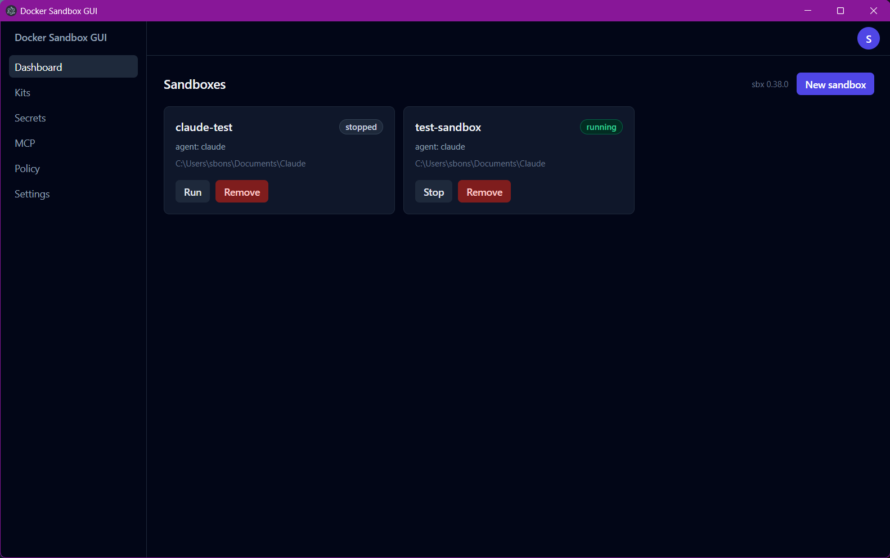

1. **Sign in.** The circular badge in the top-right shows your Docker account. If you're not signed in, click it and choose **Sign in to Docker** — this opens your browser for the real `sbx login` OAuth flow. The same dropdown holds your defaults (default tab, default chat permission mode) and sign-out:

   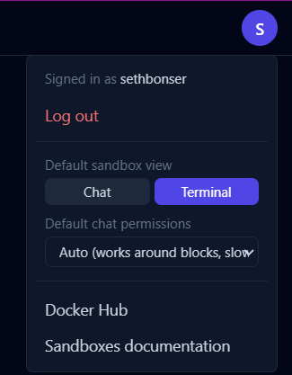

2. **Create a sandbox.** Click **New sandbox** on the Dashboard and walk through the wizard: pick an agent, choose a workspace folder, set a name and (optionally) resource limits, attach any **Kits** you want (previewed live before you commit — shows exactly what credentials, network rules, and setup steps a kit will apply), optionally publish ports or add network deny rules, then review and create.

   <details>
   <summary>Wizard walkthrough (6 steps, click to expand)</summary>

   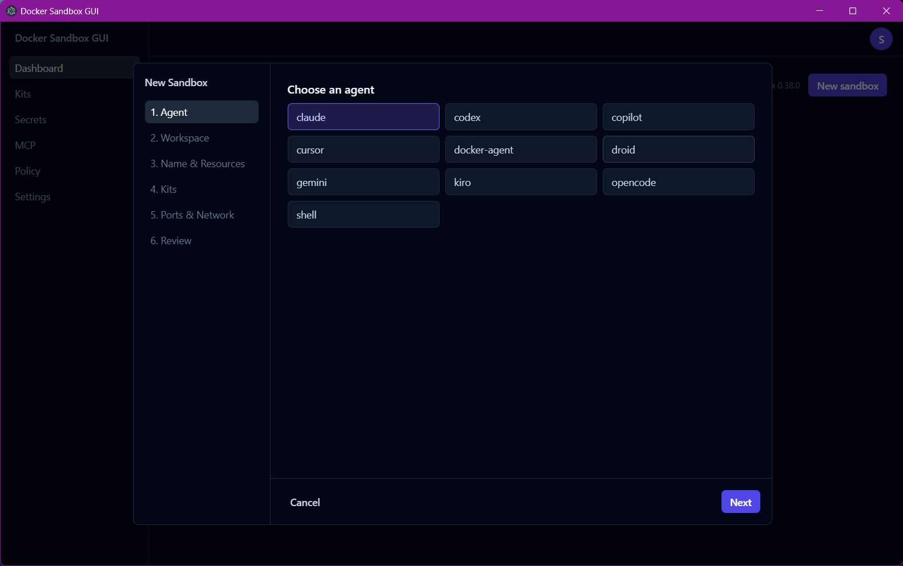
   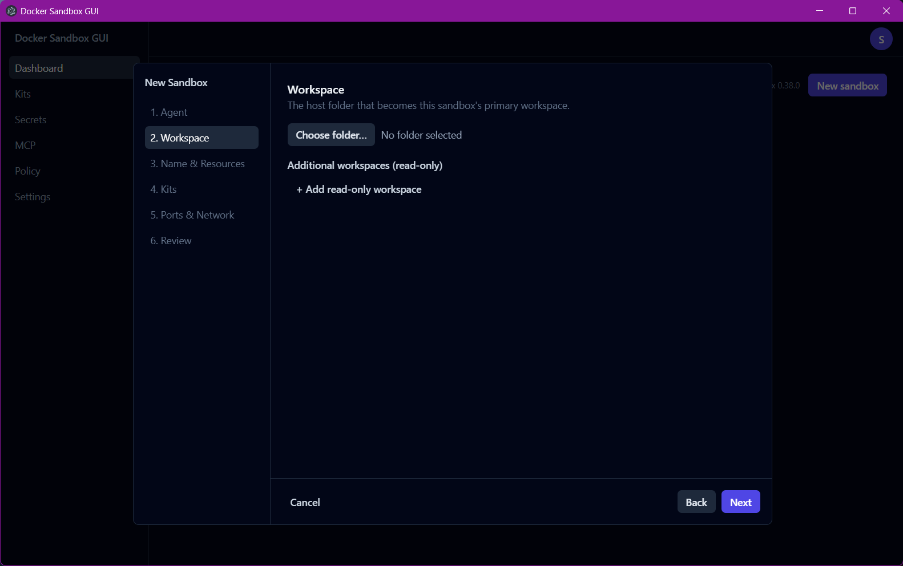
   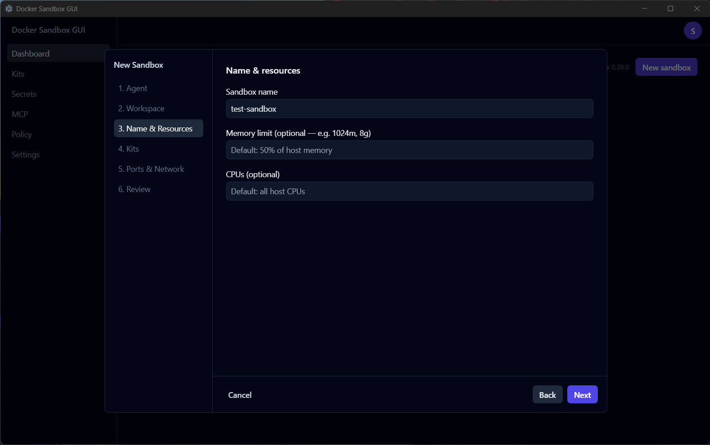
   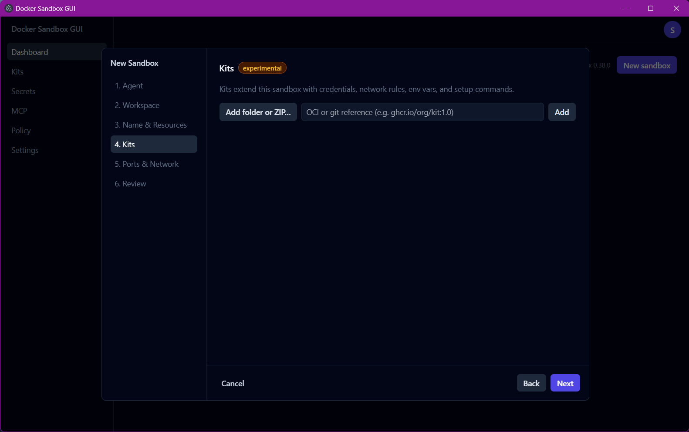
   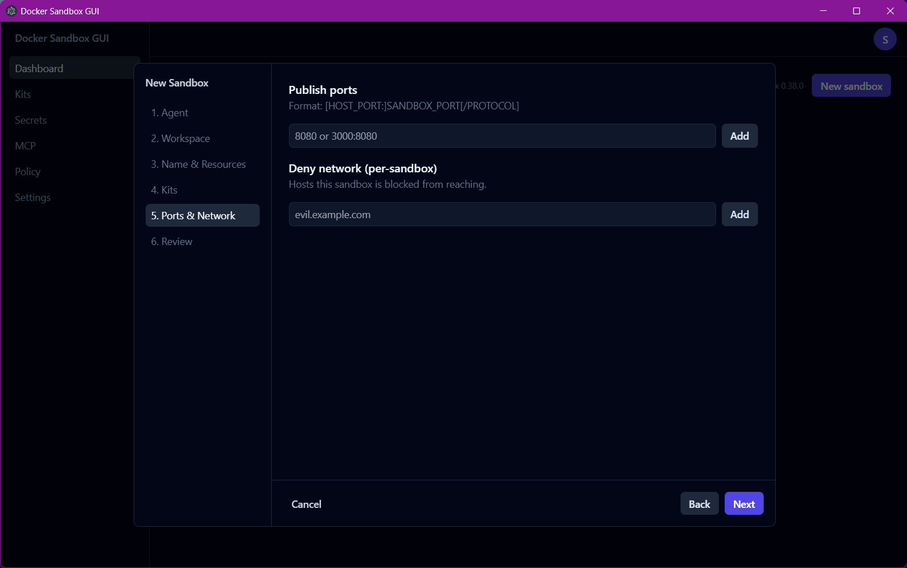
   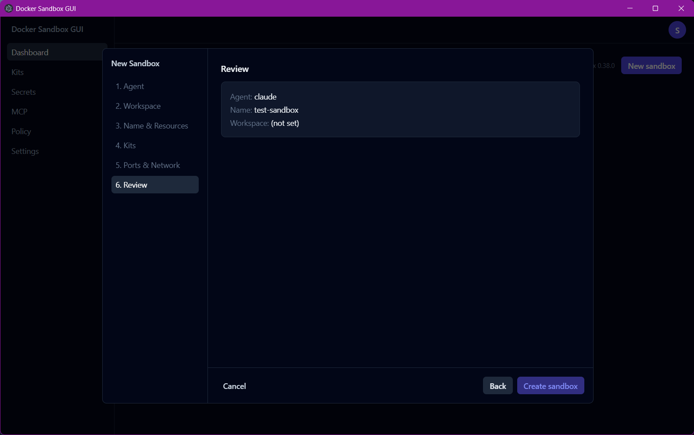

   </details>

3. **Run it.** Sandboxes you create start automatically; a stopped sandbox shows a **Run** button on its card.
4. **Chat, Terminal, Ports, or Policy.** Click into a sandbox to open its detail page — four tabs at the top, and switching between Chat/Terminal never loses anything (both stay live).

   Chat is the polished default: markdown, copyable code blocks, tool-use indicators, a **Permissions** dropdown if a command gets blocked (pick Auto or Bypass for that session, or switch to Terminal for a real interactive prompt), and a **Clear chat** button that ends the session for real (not just a visual reset — Claude's actual memory of the conversation is gone too). If the sandbox isn't signed in to Claude yet, a **Sign in to Claude** banner appears and drives the real OAuth flow — typing `/login` in chat does the same thing. Typing `/mcp` in chat shows each MCP connector's status as of when the session started, plus a banner pointing at Terminal if anything needs authorizing (that step genuinely can't happen from chat — see above).

   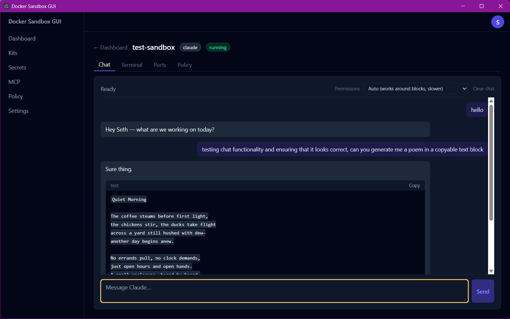

   Terminal is a real interactive session — slash-command pickers, autocomplete, and per-command approval prompts all work here, including the **Check /mcp** button that opens the live connector picker for you:

   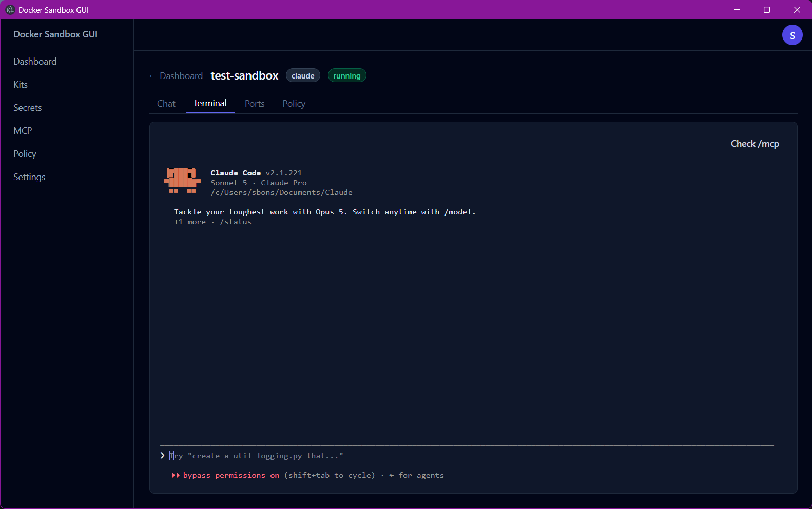

   Ports and Policy manage that one sandbox's published ports and network rules:

   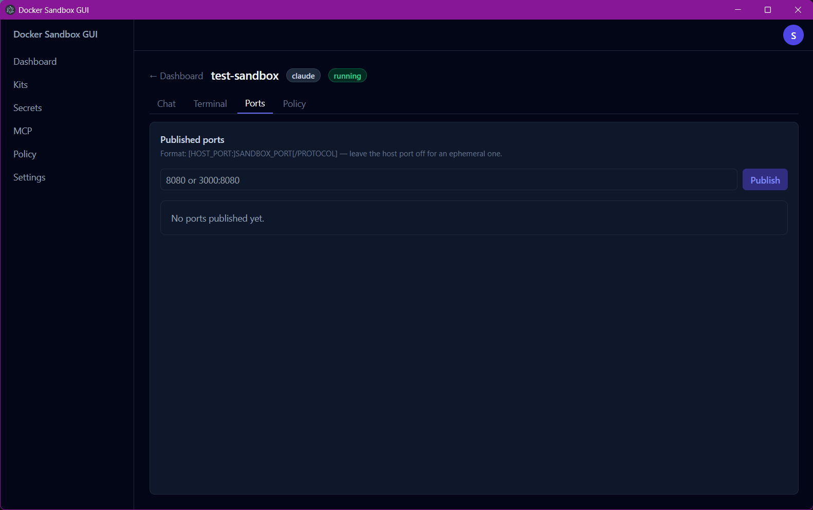
   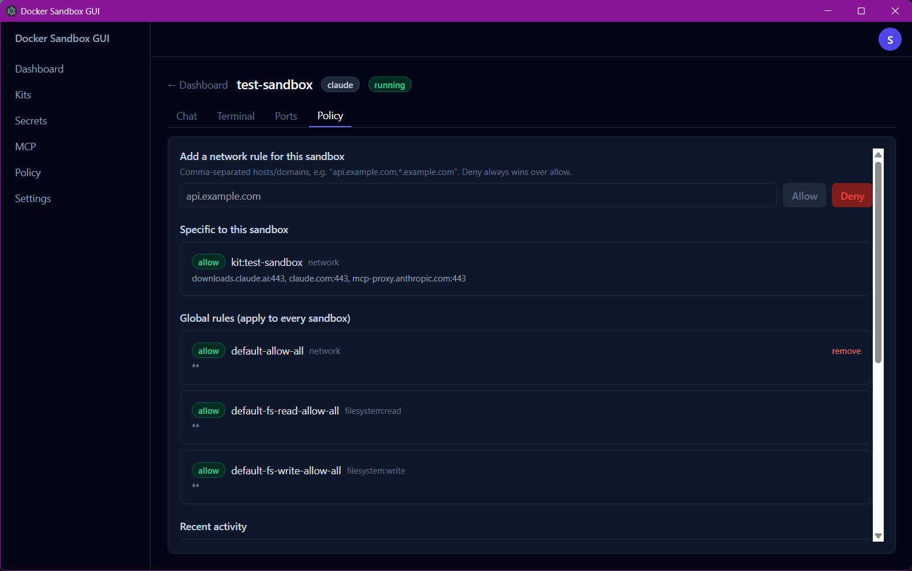

5. **MCP** (left nav) registers MCP servers, authorizes them (a real browser OAuth step — see the warning above), and loads an authorized server into any running sandbox.

   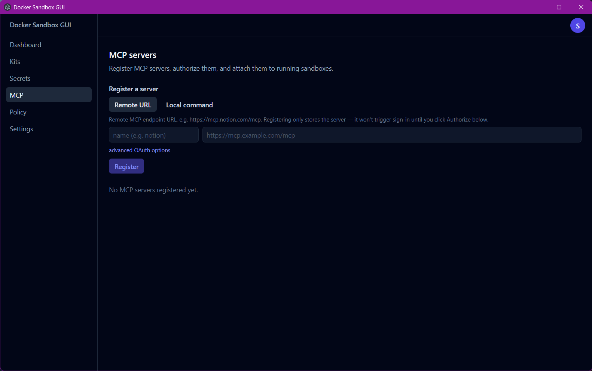

6. **Policy** (left nav) sets the global network policy tier and manages global allow/deny rules, separately from the per-sandbox Policy tab.

   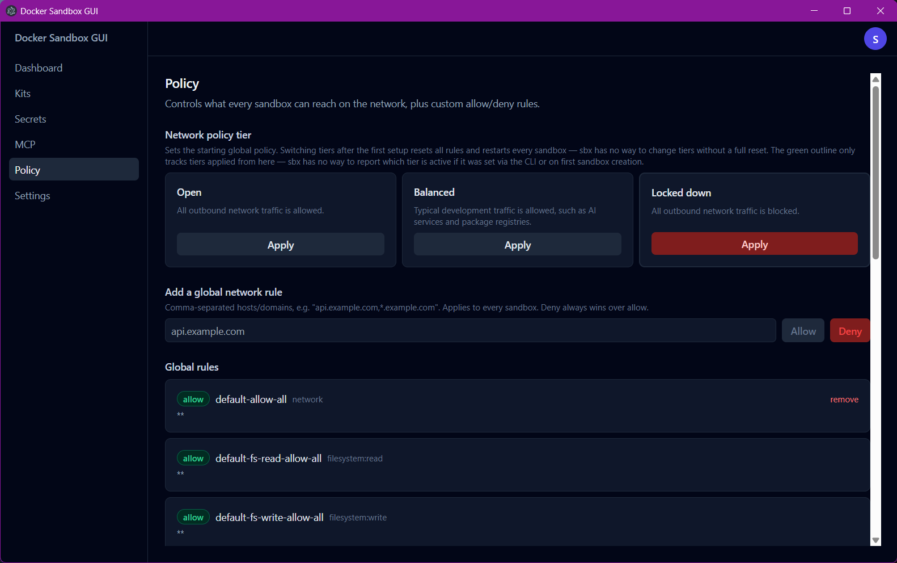

7. **Secrets** (left nav) stores the API keys and OAuth tokens agents authenticate with — one card per service, global by default or scoped to a single sandbox. `openai` gets a real OAuth sign-in button; `anthropic` gets a sandbox picker that drives the same pty-based Claude login used in Chat (its OAuth can't be started any other way); everything else takes a plain pasted API key.

   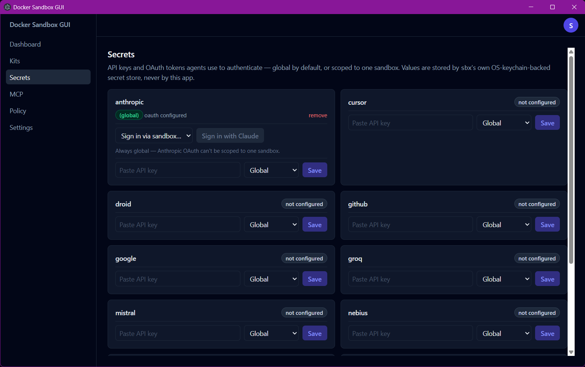

8. **Settings** (left nav) shows daemon status with Start/Restart/Stop controls, a live `sbx diagnose` viewer, and version/doc links. The account badge's dropdown (shown above) still holds your defaults — which tab (Chat/Terminal) new sandboxes open to, and which permission mode new chat sessions start with — those didn't move.

   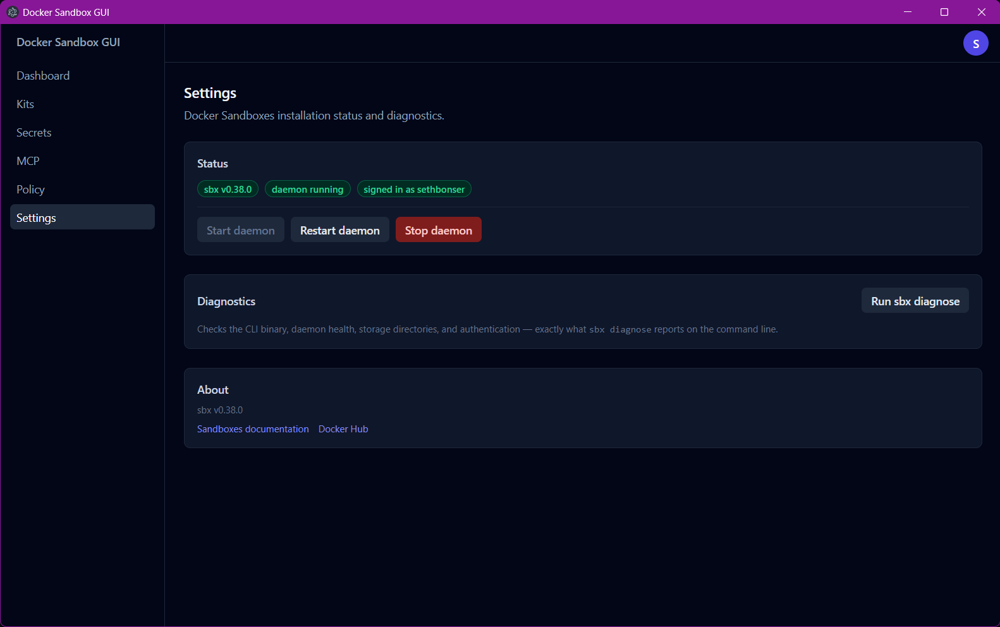

9. **Stop / Remove** from the sandbox card when you're done — Remove is permanent and asks for confirmation first.

Non-Claude agents (Codex, Gemini, etc.) can be created and run, and the Terminal tab works for them today (it's agent-agnostic) — they just don't have a *structured chat* adapter yet (the Chat tab will say so). That's tracked as upcoming work, along with first-run onboarding.

### Running on macOS

The application code is already cross-platform — there's nothing Windows-specific in the source (binary path resolution already branches between `where`/`which`, no hardcoded paths or shell quoting that differs by OS). What's *not* possible from this Windows machine is producing a `.dmg`: `electron-builder` can't cross-build a macOS target from Windows, since `.app` bundling and code signing require Apple's own toolchain. A Mac tester needs to clone the repo and build from source themselves, on their Mac, using the `npm run build:mac` steps above (or `npm run dev` for a quicker look) — they'll also need [Docker Sandboxes for Mac](https://docs.docker.com/ai/sandboxes/get-started/) (`brew install docker/tap/sbx`, then `sbx login`), which requires macOS Sonoma+ on Apple Silicon.

If anything behaves differently from the Windows build, that's genuinely useful signal — the only real testing this app has had so far is on Windows.

## Planned / upcoming work

For an agent picking this project back up: the app is built incrementally, each piece built and verified live against a real `sbx` install before moving on (not from documentation assumptions alone — the CLI's actual JSON shapes, error text, and flag requirements were all confirmed by testing, including things that turned out to *not* work as assumed — see the gotchas above). Done so far: scaffold + packaging, the Dashboard, the Create-sandbox wizard with Kits, the Claude chat panel with a live permission-mode picker and Clear chat, the embedded Terminal tab, per-sandbox Ports and Policy tabs, the global Policy page (tier switcher + custom rules), MCP server management (register/authorize/load), the Secrets manager, the real Settings screen (daemon controls + diagnostics), the Chat-tab `/mcp` status row and `/login`/`/mcp` aliasing, and the Docker/Anthropic sign-in flows described above.

**Next up:**
- **Structured chat adapter for non-Claude agents** (Codex, Gemini, Copilot, etc.) — the Terminal tab already gives them a working *interactive* session today (it's agent-agnostic), so this is specifically about parsing a non-Claude agent's own headless/structured output mode (if one exists) into the same chat-bubble UI Claude gets. Lower urgency now that Terminal covers the "can I use it at all" gap.
- **Onboarding** — first-run detection of whether `sbx` is installed at all, a guided `winget install -h Docker.sbx` flow, and steering a first-time user toward the Policy page's tier switcher. Right now the app assumes `sbx` is already installed and initialized.
- **A GitHub Actions release workflow**, building on a tag push and attaching installers to a GitHub Release, instead of building and uploading manually. Worth doing specifically because `macos-latest` runners are real Macs — this would actually unlock macOS builds, which right now can't be produced at all from this Windows machine (see [Running on macOS](#running-on-macos)). Doesn't change the unsigned/unnotarized status of either platform's output on its own; that still needs a Windows code-signing cert and an Apple Developer identity, a separate decision. Deliberately not started yet — discussed and deferred for now.

**Already resolved (was previously listed here as deferred):**
- **In-chat interactive menus** (`/mcp`, autocomplete, other slash-command pickers) *for the Chat tab specifically* remain structurally impossible — confirmed even more concretely than before: Claude Code's own harness explicitly refuses `/mcp reconnect`/`auth`/`enable`/`disable` in a headless session ("aren't available in this session"), it's not just an unimplemented picker. The Terminal tab (`xterm.js` + `node-pty`) is the answer for anything needing that real interactivity, and now has a one-click "Check /mcp" button plus deep-links from both the Chat banner and the MCP page's per-server rows.
- **Ports and Policy tabs** on the sandbox detail page, plus a **global Policy page** (tier switcher + custom rules), an **MCP server management page** (register/authorize/load), a **Secrets manager** (per-service API keys/OAuth, global or per-sandbox), and a **real Settings screen** (daemon status/start/stop/restart, an `sbx diagnose` viewer, version/doc links) in the left nav — all done, see above. Login/logout and the default-view/default-permission-mode toggles deliberately stayed in the `UserBadge` dropdown rather than moving to the new Settings page.

**Still deliberately deferred (with reasoning, so it isn't re-litigated from scratch):**
- **Authorizing an MCP connector from Chat** — not a missing feature, a hard platform limitation (see above). Don't re-attempt scripting it through the headless protocol; the Terminal tab is the only real path, and Chat already links to it.
- **Some claude.ai connectors (Gmail, Google Calendar, Microsoft 365) can't be authorized from this app at all** — confirmed against Anthropic's own docs: those specific hosts don't support local OAuth from Claude Code because the upstream identity provider only accepts the redirect URL claude.ai itself registered. Even the Terminal's real `/mcp` picker just points at `claude.ai/customize/connectors` for those three. Not a bug to fix here.
- **Registry secrets and `sbx secret import`** — asked and confirmed out of scope for the Secrets manager's v1: registry pull credentials are a separate, less common concern from service API keys, and env-var auto-detection is a convenience layered on top of the same `secretSet`/`secretList` plumbing already built, not a blocker to add later.
- **Kit authoring** (`sbx kit pack`/`push`) — the app only *uses* kits (inspect/validate/apply), doesn't build them.
- `sbx skills` UI, `sbx cp` (file transfer) UI.
- **macOS code signing and notarization** — needs an Apple Developer identity and an actual Mac; the `.dmg` build is otherwise ready to go (see above).
- **Auto-update.**
